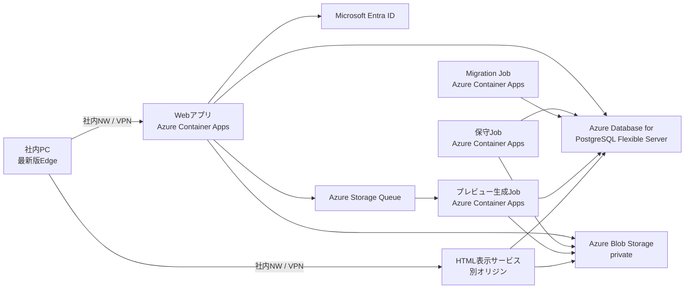
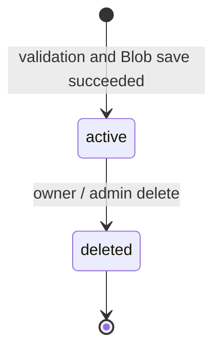

# 「資料みて！」アプリケーション設計

## 1. 文書情報

- 状態: 実装準備完了
- 対象: 初期リリース
- 最終更新日: 2026-07-26
- 実装状態: 業務機能未着手

この文書は、`docs/ラフ仕様.md`と要件ヒアリングの結果をもとに、初期リリースの
機能、データ、セキュリティ、運用の設計を定義する。

## 2. 目的

Entra IDで許可された社内ユーザーが、閲覧用HTML資料をアップロードし、固定URLを
使って安全に共有できるようにする。

アップロードされたHTMLは信頼しない。アプリ本体とは別のオリジンで表示し、
実行可能な機能と外部リソースの自動読み込みを無効化する。

## 3. 対象範囲

### 3.1 初期リリースに含める機能

- 単一の`.html`または`.htm`ファイルのアップロード
- ドラッグ＆ドロップとファイル選択
- 1回につき1ファイルのアップロード
- 形式・リンク検査、無効化対象機能の警告
- 資料ごとの推測困難な固定URL
- ログイン済み利用者間でのURL共有
- 所有者別の資料一覧
- 静止画によるリンクプレビュー
- 資料URLのコピー
- 所有者による削除
- 管理者による全資料の検索、閲覧、強制削除
- 管理者による監査履歴の検索、閲覧
- アップロード、閲覧、削除の監査

### 3.2 初期リリースに含めない機能

- ZIPファイルと複数アセットのアップロード
- 複数ファイルの一括アップロード
- アップロードHTMLのダウンロード
- 資料の差し替え、版管理
- オーナー変更
- 一般ユーザー向けの検索、絞り込み
- ごみ箱、利用者による復元
- 監査履歴のCSV出力
- アプリ独自のメール通知
- スマートフォン、タブレット対応
- 管理画面からの環境設定変更
- プレビュー生成失敗後の管理者による手動再実行
- Teams Link Unfurlingによる資料固有のAdaptive Card・スクリーンショット表示
- Teamsなどのcrawler向けに認証不要で資料情報を返すOGP・preview endpoint

## 4. 利用者と権限

### 4.1 Entra ID App Roles

Entra IDのエンタープライズアプリで「割り当てが必要」を有効にし、次の2種類の
App Roleを定義する。

- `User`
- `Admin`

既存のEntra IDセキュリティグループをエンタープライズアプリ上で各App Roleへ
割り当てる。アプリはIDトークンの`roles` claimを検証し、グループObject IDや
`groups` claimには依存しない。`Admin`は一般機能と管理機能の両方を利用でき、
`User`との二重割り当てを必要としない。

テナントは`tid`で固定し、利用者の内部識別子には`oid`を使う。ログイン時は`email`
claim（未提供時は`preferred_username`）を検証し、環境変数で明示したメールドメイン
との完全一致を必須とする。サブドメインは個別に許可する。メールアドレスはこの
ログイン可否判定と表示・監査時点の確認に使い、利用者識別やデータ単位の認可のキーには
しない。署名付きCookie
セッションはログインから8時間で固定失効し、操作による延長は行わない。App Roleの
変更は次回ログインまたは最大8時間後に反映される。即時失効が必要になった場合にだけ
サーバー側セッションを再検討する。

### 4.2 権限表

| 操作 | 一般ユーザー | オーナー | 管理者 |
|---|---:|---:|---:|
| HTMLのアップロード | 可 | 可 | 可 |
| URLを知っている資料の閲覧 | 可 | 可 | 可 |
| 自分の資料一覧の閲覧 | 可 | 可 | 可 |
| 自分の資料の削除 | - | 可 | 可 |
| 他人の資料一覧・検索 | 不可 | 不可 | 可 |
| 他人の資料の強制削除 | 不可 | 不可 | 可 |
| 監査履歴の検索・閲覧 | 不可 | 不可 | 可 |
| オーナー変更 | 不可 | 不可 | 不可 |

オーナー判定にはEntra IDの変更されにくい内部識別子を使う。メールアドレスは
画面表示と監査時点の利用者確認に使い、認可判定には使わない。

すべての認可はloader、action、表示サービス、データアクセス直前でサーバー側が
実施する。UIの非表示だけを認可に使用しない。

## 5. 画面設計

### 5.1 ログイン画面

- Entra IDログインへの導線を表示する。
- ログイン済みの場合は初期画面へ遷移する。

### 5.2 初期画面

- アプリ名「資料みて！」を表示する。
- ログインユーザーの氏名とメールアドレスを表示する。
- HTMLのドロップ領域と「ファイルを選択」ボタンを表示する。
- 1回につき1ファイルだけ受け付ける。
- 自分がアップロードした資料だけを新しい順に表示する。
- 初回20件を表示し、「次を表示」で20件ずつ追加する。
- 一般ユーザー向けの検索・絞り込みは設けない。

カードには次を表示する。

- プレビュー画像。生成失敗時は共通の代替画像
- HTMLの`title`。取得できない場合は元ファイル名
- 元ファイル名
- アップロード日時
- ファイルサイズ
- プレビュー状態
- 資料を開く操作
- URLをコピーする操作
- オーナーだけに表示する削除操作

日時は日本時間で`YYYY/MM/DD HH:mm`形式とし、DBにはUTCで保存する。

### 5.3 アップロード結果

- 基本検査とリンク検査が完了したら、資料表示画面へ遷移する。
- JavaScriptや無効化対象の機能を検出した場合は、表示時に動作しないことを警告する。
- プレビュー画像はバックグラウンドで生成する。
- 生成中は共通の処理中画像、生成失敗時は共通の代替画像をカードへ表示する。

### 5.4 資料表示画面

- 固定URLは`/documents/{documentId}`形式とする。
- 未ログインの場合はEntra IDログイン後に同じURLへ戻す。
- 所有者以外も、URLを知っているログイン済みユーザーであれば閲覧できる。
- 上部に「URLをコピー」と「初期画面へ戻る」を表示する。
- Teamsなどへ共有するのはこのアプリ側固定URLとし、DisplayのURLやgrantは共有しない。
- 初期リリースではTeams上の資料固有プレビューを保証せず、URLまたは汎用的な
  アプリ情報だけが表示される前提とする。
- HTMLは別オリジンの制限付き`iframe`内へ表示する。
- アプリのJavaScriptを必須とし、無効時は資料本文を表示しない。
- アップロードHTMLのダウンロード操作は設けない。
- 閲覧成功を監査履歴へ記録する。

### 5.5 削除確認

- 資料タイトルを表示する。
- 削除後は利用者が復元できないことを表示する。
- 確認後にだけ削除actionを実行する。

### 5.6 管理画面

全資料を次の条件で検索できる。

- 資料ID
- オーナーのメールアドレス
- 元ファイル名
- アップロード日時

管理者は資料を閲覧し、強制削除できる。オーナー変更はできない。管理者による
閲覧と削除も監査履歴へ記録する。

### 5.7 監査履歴画面

管理者だけが、アップロード、閲覧、削除、管理操作の履歴を、日時、利用者、
資料ID、操作、結果で検索・閲覧できる。監査履歴の閲覧自体も監査対象とする。
CSV出力と詳細分析機能は設けない。

## 6. HTML受け入れ仕様

### 6.1 基本条件

- 拡張子は`.html`または`.htm`
- ファイルは空でない
- UTF-8として読み取れる
- HTML文書として解析できる
- 最大サイズは10MB
- 1ユーザーあたりの有効な資料は最大100件
- 1ユーザーあたりの有効なHTML合計は最大500MB
- システム全体の有効なHTML合計は最大50GBとし、40GBで管理者へ警告する
- プレビュー画像は1件あたり最大1MB
- 削除済み資料は件数・容量上限の計算から除外する
- 保存期限は設けない
- 1ユーザーあたり1分間に最大5回までアップロードできる
- 同じユーザーの同時アップロードは1件までとする
- 件数、容量、頻度、同時実行の判定はPostgreSQLを使い、Redisなどは追加しない
- 制限値は環境設定で変更可能とする

Content-Type、拡張子、ファイル名は信用せず、サーバー側で内容を検査する。
ファイル名と`title`は表示用文字列として長さを制限し、HTMLとして解釈しない。

### 6.2 動的機能の扱い

JavaScript、`iframe`、フォームなどを含むことだけを理由にアップロードを拒否しない。
ただし、表示時には次の機能を無効化する。

- `javascript:`リンクを含むすべてのJavaScript
- inline event handler
- fetch、XHR、WebSocket、Beacon
- 外部画像、外部CSS、外部font、外部media
- `iframe`、`frame`、`object`、`embed`
- フォーム送信
- JavaScriptによるポップアップ
- ダウンロード
- Local Storage、Cookieなどの状態保存

無効化によって資料の一部または全部が表示されない可能性がある。アップロード時に
検出できた項目は警告として利用者へ示す。

表示に必要なCSSはHTML内へ、画像とfontはData URLへ含める自己完結HTMLを前提とする。
HTML属性で検出できる外部画像、stylesheet、font、media、`iframe`などの外部resource
参照は拒否する。inline CSS内など検査をすり抜けた外部resourceはCSPで遮断し、
プレビューと実表示の双方で読み込まない。

アップロードされたHTMLの内容は改変せず、単一のprivate Blobとして保存する。
表示サービスは同じHTMLへHTTPレスポンスヘッダーでCSPとsandboxを強制する。
`meta refresh`、`base href`、ページ内リンク以外の相対リンク、またはリンク先が
`data:`、`file:`、未許可の独自schemeである場合は、検出箇所を書き換えず、
アップロード自体を拒否する。

### 6.3 リンク

外部リソースの自動読み込みは禁止するが、利用者がクリックする外部リンクは
次の条件で許可する。

- 絶対URLの`https://`と`http://`は許可リストなしで許可する。
- `#section`など同一ページ内リンクは許可する。
- `javascript:`リンクは受け付けるが、CSPとsandboxにより動作させない。
- `data:`、`file:`、その他のschemeをリンク先に使うHTMLは拒否する。
- ページ内リンク以外の相対リンクと`base href`を含むHTMLは拒否する。
- `meta refresh`を含むHTMLは拒否する。
- `target`省略時と`target="_self"`は同じiframe内で開く。
- `target="_blank"`は新しいタブで開く。
- `target="_top"`と`target="_parent"`は無効化し、アプリ画面を維持する。
- アプリ独自の確認画面とリンククリック監査は設けない。
- `Referrer-Policy: no-referrer`を適用する。

URL解析には標準のURLパーサーを使い、scheme名の大文字小文字、空白、文字参照などを
正規化したうえで判定する。

## 7. システム構成



### 7.1 Webアプリ

- React Router Framework Mode、SSR有効、RSC不使用
- 認証、認可、アップロード受付、一覧、管理、監査画面を担当
- 保護対象loader/actionの先頭で`requireUser(request)`を呼ぶ
- cookie認証のすべてのmutation actionで`assertSameOrigin(request)`を呼ぶ
- URLパラメーター、FormData、検索条件をZodで検証する
- アップロードは`POST /documents`へ`application/octet-stream`で送り、UTF-8
  ファイル名は`X-File-Name`へbase64urlで格納する
- `Content-Length`の事前検査に加え、streaming中も10MBを超えた時点で中止する

### 7.2 HTML表示サービス

- アプリ本体とは異なる専用オリジンで稼働する。
- アプリのセッションCookieを受け取らない。
- Node.js標準HTTPサーバーで実装し、`GET /health`と`POST /display`だけを公開する。
- アプリJavaScriptが生成する一時的なhidden formから、署名付き表示grantを
  `application/x-www-form-urlencoded`のPOST bodyでiframeへ送る。
- POST bodyは最大8KB、`Origin`はアプリオリジンだけを許可し、grantの有効期間は
  60秒とする。URL、クエリ文字列、Cookieではgrantを受け取らない。
- grantはEd25519で署名し、資料ID、操作利用者の`oid`、操作時点のメールアドレス、
  有効期限、ランダムnonce、`keyId`を含む。Blobキーとファイル名は含めない。
- grantの署名、期限、対象資料を検証し、DBで資料が`active`であることを再確認する。
- 有効かつ削除されていないHTMLをBlobから取得した後、閲覧成功監査を保存してから返す。
- grantとPOST bodyをアプリケーションログ、ingressログ、エラーログへ記録しない。
- 表示用レスポンスへ強制CSPとsandboxを設定する。
- アプリオリジン以外からの埋め込みを拒否する。

コピー対象はアプリ側の固定URLであり、短期grant付き表示URLはコピー対象にしない。

### 7.3 Blob Storage

少なくとも次の領域を分離し、資料IDからキーを決定的に導出する。

- 非公開HTML: `html/{documentId}/document.html`
- プレビュー画像: `preview/{documentId}/preview.jpg`

すべてprivate containerとし、利用者へBlob SAS URLを直接公開しない。Blobキーは
DBへ保存しない。サービス間はManaged Identityを使用する。production、stagingとも
LRSを使い、ゾーン冗長と別リージョン複製は行わない。

### 7.4 PostgreSQL

Azure Database for PostgreSQL Flexible Serverを使い、資料メタデータ、表示状態、
監査履歴を保存する。HTML本文とプレビュー画像はDBへ保存しない。

- productionはGeneral Purpose、2 vCore、8GB memory、初期storage 32GBとする。
- stagingはBurstable B1ms、1 vCore、2GB memory、初期storage 32GBとする。
- production、stagingともHAとゾーン冗長は使用しない。
- productionはstorage自動拡張を有効にし、使用率70%で警告、85%で緊急通知する。
- Node.jsからは`pg`を使い、ORMは導入しない。
- loader/action、service、repositoryの順に分離し、SQLはrepositoryの`.server.ts`へ置く。
- Web、Display、Preview、Maintenanceは別々のManaged Identityを使い、Entra IDの
  access tokenを`pg`のpasswordとして接続する。DB roleは用途別に最小権限とする。
- マイグレーションは`node-pg-migrate`を使い、専用Managed IdentityのMigration Jobが
  デプロイ前に1回実行する。runtime identityにはDDL権限を与えない。
- productionのマイグレーションはforward-onlyかつ新旧アプリに対して互換にし、
  破壊的変更は複数リリースへ分け、自動down migrationは行わない。

### 7.5 Storage Queueとプレビューワーカー

- 表示準備の完了後、Webアプリがプレビュー生成メッセージをStorage Queueへ送る。
- Container Apps Jobはキューにメッセージがある場合だけ起動し、通常は停止する。
- 処理は同じメッセージを複数回受け取っても結果が壊れないようにする。
- 最大3回試行し、3回失敗した場合はプレビュー状態を`failed`へ変更する。
- 恒久失敗時はエラー分類を監査・運用ログへ記録してメッセージを削除し、
  専用の失敗キューは設けない。
- ワーカーは非root、読み取り専用filesystem、短いtimeout、CPU・メモリ上限を使う。
- プレビュー生成ブラウザはJavaScript無効、外部ネットワーク接続なしで実行する。
- ワーカーは処理ごとに破棄できる構成とする。
- Queueメッセージは`schemaVersion`と`documentId`だけを含む。
- visibility timeoutは60秒、1メッセージの処理上限は30秒、Job実行上限は45秒とし、
  1実行で1メッセージだけを処理する。
- `dequeueCount`で最大3回を判定し、3回目の失敗でDBを`failed`へ更新して
  監査を保存した後、メッセージを削除する。
- Playwright公式Ubuntu imageをPlaywright versionと一致させて固定し、非root、
  Chromium sandbox有効、service worker無効、JavaScript無効で実行する。
- 1280x720 viewport、白背景、animation無効、viewport範囲だけをJPEGで撮影する。
  描画timeoutは10秒とし、品質を下げても1MB以下にならない場合は`failed`とする。
- Container Apps Job上でChromium sandboxが有効であることを確認するsecurity spikeを
  Preview実装の完了条件とし、sandbox無効でしか起動できない構成は採用しない。

### 7.6 実行単位とコンテナimage

- WebとDisplayは同じNode.js用Docker imageを異なるcommandとManaged Identityで使う。
- Preview JobはChromiumを含む専用Dockerfileと専用imageを使う。
- Migration JobとMaintenance JobはWeb・Displayと同じNode.js imageを使う。
- 5つのAzure実行単位に対し、コンテナimageは2種類だけとする。
- production Web・Displayは各0.5 vCPU、1GB、最小1・最大3レプリカとする。
- staging Web・Displayは最小0レプリカとする。
- Preview Jobは1 vCPU、2GB、最大2件並列とする。
- Migration・Maintenance Jobは0.5 vCPU、1GB、並列実行しない。
- Container Apps Environmentのゾーン冗長はproduction、stagingとも使用しない。

### 7.7 定期保守Job

Maintenance Jobを毎日UTC 18:00（JST 03:00）に実行する。Blob削除失敗資料を
`blob_cleanup_pending`で抽出して冪等に再試行し、削除済み資料の最小メタデータと
監査履歴を1年経過後に削除する。Blob削除が完了していない資料メタデータはpurgeしない。

## 8. ネットワーク設計

- Azure regionはJapan Eastとする。
- 利用者向けアプリとHTML表示オリジンは社内ネットワークからだけ到達可能にする。
- 在宅勤務者は会社VPNまたは承認済み社内接続基盤を経由する。
- PostgreSQLとBlob Storage（Storage Queueを含む）はprivate endpointを使用する。
- Container Appsから各Azureサービスへは用途別のManaged Identityで接続する。
- アプリ、Display、PostgreSQL、Storageのpublic network accessは無効化する。
- ACRだけはGitHub-hosted runnerからpushするため、認証付きpublic endpointを有効にする。
  ACR管理者accountは無効化し、runtimeはManaged Identityの`AcrPull`を使う。
- HTML表示サービスとプレビューワーカーから外部インターネットへの通信を禁止する。
- Entra IDやAzure管理サービスへの必要な通信は、対象コンポーネントごとに限定する。
- WebとDisplayには会社の異なるカスタムドメインを使う。正式なホスト名と証明書は
  環境別Bicepパラメーターとし、リポジトリへ実値を保存しない。

## 9. セキュリティ設計

### 9.1 信頼境界

次をすべて信頼しない入力として扱う。

- HTML本文
- ファイル名、拡張子、Content-Type
- HTMLの`title`
- URLパラメーター
- FormData
- 外部リンクURL
- Blob StorageとStorage Queueなど外部サービスの応答

### 9.2 表示制御

表示サービスは、少なくとも次の意図を持つCSPをHTTPレスポンスヘッダーで付与する。
実装時には最新版Edgeで結合テストを行い、最終値を確定する。

```text
default-src 'none';
script-src 'none';
connect-src 'none';
frame-src 'none';
object-src 'none';
form-action 'none';
base-uri 'none';
style-src 'unsafe-inline';
img-src data: blob:;
font-src data:;
frame-ancestors <アプリオリジン>;
sandbox allow-popups allow-popups-to-escape-sandbox;
```

アプリ側の`iframe`にも`allow-popups`と`allow-popups-to-escape-sandbox`だけを
追加したsandboxを指定する。これは利用者がHTML内の`target="_blank"`リンクを
新しいタブで開くための許可であり、script、form、download、same-origin、
`target="_top"`・`target="_parent"`による親画面遷移は許可しない。
表示サービスではアプリ本体用の`X-Frame-Options: DENY`を流用せず、
`frame-ancestors`でアプリオリジンだけを許可する。

### 9.3 初期リリースのファイル安全性

- 初期リリースではDefenderなどの非同期マルウェア検査を使用しない。
- 受け付ける形式を単一HTML、UTF-8、最大10MBに限定する。
- HTMLは単一のprivate Blobへ保存し、表示サービスだけを経由して配信する。
- JavaScriptと外部resourceをCSPとsandboxで無効化する。
- 表示とプレビュー生成には会社管理下の更新済みEdgeまたはChromiumを使用する。
- ZIP、複数asset、HTMLのダウンロード、JavaScript実行を追加する場合は、
  マルウェア検査の導入を改めて脅威分析する。

### 9.4 脅威と対策

| 脅威 | 主な対策 |
|---|---|
| HTMLによるセッション窃取 | 別オリジン、Cookie非共有、CSP、sandbox |
| JavaScript実行 | `script-src 'none'`、sandbox |
| 外部への情報送信 | fetch系禁止、外部resource禁止、表示サービスの外向き通信禁止 |
| 自動転送 | `meta refresh`をアップロード時に拒否 |
| 危険なリンク | scheme検証、`data:`・`file:`・独自schemeを拒否 |
| ID推測 | 暗号学的に推測困難なランダム資料ID |
| IDOR | 資料取得・削除直前のサーバー認可 |
| CSRF | cookie認証mutationの同一オリジン検証 |
| 悪意あるHTML | 形式・リンク検査、CSP、sandbox、別オリジン |
| プレビュー生成攻撃 | 別ワーカー、非root、ネットワーク遮断、資源制限、timeout |
| 大容量・資源枯渇 | 10MB上限、ユーザー・全体容量上限、頻度・同時実行制限、監視 |
| grant漏えい | no-referrer、60秒表示grant、POST body、body非記録、private network |

### 9.5 暗号化とシークレット

- 保存時暗号化はAzure標準のMicrosoft管理キーを使用する。
- アプリ、表示サービス、Azureサービス間の通信はTLSとする。
- HTML内で利用者がクリックする遷移先は`http:`の場合がある。この通信はアプリが
  管理するサービス間通信ではなく、遷移先の安全性と機密性を保証しない。
- セッション署名鍵、grant署名用Ed25519秘密鍵、ログ用HMAC鍵、Entra IDの
  有効期限付きclient secretは環境ごとにKey Vaultで管理する。
- Container AppsのKey Vault参照から環境変数へ渡し、アプリコードからKey Vault APIを
  直接呼ばない。Webだけがgrant秘密鍵を持ち、Displayは公開鍵だけを持つ。grant署名鍵は
  `keyId`で新旧鍵を併用してrotationする。
- client secret、token、Cookie、表示grant、request body、URLのクエリ文字列を
  ログへ記録しない。
- HTML本文、プレビュー、ファイル名をログへ記録しない。

## 10. 処理フロー

### 10.1 アップロード

1. `requireUser(request)`で認証する。
2. `assertSameOrigin(request)`で同一オリジンを検証する。
3. PostgreSQL transactionとadvisory lockを使い、ユーザー・システム単位の件数と
   容量、ユーザー単位の頻度と同時実行制限を競合なく確認する。システム全体の
   upload判定は直列化する。
4. raw bodyと`X-File-Name`をZodとstreaming上限で検証し、拡張子、サイズ、UTF-8、
   空ファイルを確認する。
5. `parse5`でbrowser相当のtreeへ解析し、`meta refresh`、`base href`、相対リンク、
   禁止scheme、外部resourceを検証する。通常のHTML構文誤りは警告とし、UTF-8不正、
   空ファイル、10MB超過、parserの致命的失敗は拒否する。HTMLは書き換えない。
6. Node.jsの`randomUUID()`でUUID v4資料IDを発行し、HTMLをprivate Blobへ保存する。
7. PostgreSQLへ`active`、プレビュー状態`pending`として保存する。
8. Storage Queueへプレビュー生成メッセージを送る。
9. Queue送信に失敗した場合はプレビュー状態を`failed`へ変更する。
10. 資料表示画面へ案内する。

### 10.2 入力またはプレビュー処理失敗

- 形式不正、`meta refresh`、`base href`、ページ内以外の相対リンク、禁止schemeは
  保存せず、短い日本語エラーを表示する。
- 保存処理に失敗した場合は、不完全なBlobとDBレコードを削除する。
- Queue送信に失敗した場合も資料は閲覧可能にし、代替画像を使う。
- プレビュー生成の一時障害はStorage Queueで最大3回試行する。
- 3回失敗した場合は`failed`として代替画像を表示し、手動再実行は設けない。
- 処理の成功・失敗は監査履歴へ残す。

### 10.3 閲覧

1. アプリ側固定URLで`requireUser(request)`を実行する。
2. 資料が`active`で、削除されていないことを確認する。
3. 対象資料と操作利用者を含む60秒有効な表示grantを発行する。
4. アプリJavaScriptがhidden formを生成し、別オリジンの`POST /display`をsandbox付き
   `iframe`へtarget指定して、POST bodyでgrantを送る。
5. 表示サービスがOrigin、body上限、grant、資料状態を再検証し、資料IDから導出した
   Blobを取得する。
6. 表示サービスがgrant内の利用者情報で閲覧成功監査を保存する。監査保存に失敗した
   場合はHTMLを返さない。
7. 表示サービスがHTMLを返す。JavaScript無効時の手動POST fallbackは設けない。

認証拒否、資料不存在、grant不正、Blob取得失敗は、発生した境界で`denied`または
`failed`として監査する。

### 10.4 削除

1. `requireUser(request)`と`assertSameOrigin(request)`を実行する。
2. オーナーまたは管理者であることをデータ更新直前に確認する。
3. DBトランザクション内で資料を`deleted`へ変更し、削除対象情報を消去して、
   削除監査を保存する。監査保存に失敗した場合はトランザクションをrollbackする。
4. commit後、資料IDから導出したHTMLとプレビュー画像をBlobから削除する。
5. Blob削除に失敗しても閲覧禁止は維持し、運用エラーを記録して定期削除処理で
   冪等に再試行する。
6. 資料ID、オーナー内部ID、登録・削除日時、削除実行者内部ID、`deleted`状態を
   1年間保持する。

削除済みURLは再利用せず、「資料が見つかりません」と表示する。権限や存在有無を
推測しにくくするため、一般利用者には削除済みと未存在を同じ表示にする。

## 11. 状態モデル

### 11.1 資料状態



検証または保存に失敗したアップロードは資料レコードを残さず、失敗監査だけを保存する。
プレビュー状態は資料状態と分け、`pending`、`ready`、`failed`を持つ。プレビュー
失敗は資料本文の閲覧を妨げない。

## 12. データモデル

### 12.1 `documents`

| 項目 | 概要 |
|---|---|
| `id` | 推測困難なランダム資料ID |
| `owner_subject_id` | Entra内部識別子 |
| `owner_email_at_upload` | アップロード時のメールアドレス。削除時に消去 |
| `original_file_name` | 元ファイル名。削除時に消去 |
| `title` | HTML titleまたはファイル名。削除時に消去 |
| `byte_size` | HTMLのbyte数。削除時に消去 |
| `status` | 資料状態 |
| `preview_status` | プレビュー状態。削除時に消去 |
| `warning_codes` | 無効化される機能の分類。削除時に消去 |
| `created_at` | UTC登録日時 |
| `deleted_at` | UTC削除日時 |
| `deleted_by_subject_id` | 削除実行者 |
| `blob_cleanup_pending` | Blob削除の再試行が必要か |

### 12.2 `audit_events`

| 項目 | 概要 |
|---|---|
| `id` | 監査イベントID |
| `occurred_at` | UTC発生日時 |
| `action` | upload、view、delete、admin operationなど |
| `result` | success、denied、failed |
| `document_id` | 対象資料ID |
| `actor_subject_id` | Entra内部識別子 |
| `actor_email_at_event` | 操作時点のメールアドレス |
| `correlation_id` | 一連の処理を追跡するランダムID |
| `error_category` | 秘密情報を含まない分類 |
| `retain_until` | 1年後の削除予定日時 |

HTML本文、質問・回答全文、token、Cookie、ファイル名、IPアドレスは監査イベントへ
保存しない。監査イベントは追記専用とし、通常のアプリ操作から更新・削除できない。

## 13. ルート案

| URL | 用途 |
|---|---|
| `/` | 未ログイン画面 |
| `/app` | 初期画面、所有資料一覧 |
| `/documents` | アップロードaction |
| `/documents/:documentId` | 資料表示画面 |
| `/documents/:documentId/preview-status` | プレビュー状態resource route |
| `/documents/:documentId/delete` | 所有者・管理者削除action |
| `/admin/documents` | 全資料の検索・管理 |
| `/admin/audit` | 監査履歴の検索 |

表示サービスは別ホストで、`GET /health`と60秒grantをPOST bodyで受ける
`POST /display`だけを公開する。

## 14. エラー方針

- 利用者には短い日本語メッセージを表示する。
- stack trace、Blobキー、DB情報、内部URL、外部サービス応答を表示しない。
- 画面へ相関IDを表示し、運用担当者がログを検索できるようにする。
- 資料不存在、削除済み、閲覧不可を一般利用者向けには区別しすぎない。
- 外部サービスにはtimeoutを設定する。
- HTMLの解析または安全性検査に失敗した場合、未検査のHTMLを保存・表示する
  fallbackは設けない。

## 15. 監査・ログ

### 15.1 監査履歴

- 保存期間は1年
- アップロード、閲覧、削除、管理操作を記録
- 成功、拒否、失敗を記録
- 管理者による監査履歴閲覧も記録
- アップロード、削除、管理操作は業務更新と監査を同じDBトランザクションで保存する
- 閲覧成功は表示サービスがHTMLを返す直前に保存する
- 監査保存に失敗した操作は成功させない
- CSV出力なし
- 期限経過後は定期処理で削除

### 15.2 運用ログ

stdoutへ1行1eventのJSONで出力する。相関IDはserver側でUUIDとして発行し、HTTP responseと
利用者向けerror画面にも表示する。ログ出力自体の一時失敗は業務処理を止めないが、
監査DB書き込み失敗は対象操作を失敗させる。

記録するもの:

- 相関ID
- 時刻
- 処理名
- 成否
- エラー分類
- 利用者`oid`をログ専用鍵でHMAC化した識別子

記録しないもの:

- HTML本文
- プレビュー画像
- 元ファイル名
- メールアドレスなどの個人情報
- access token、client secret、Cookie、表示grant、request body、URLのクエリ文字列
- HTMLに含まれるリンクの完全なURL。検査結果はURLそのものではなく分類だけを記録

## 16. バックアップと削除

- PostgreSQLのpoint-in-time restoreとBlob soft deleteを7日間有効にする。
- RPOは24時間、RTOは8時間を目標とする。
- HA、ゾーン冗長、別リージョン複製は初期構成に含めない。
- 四半期ごとに復元試験を行う。
- 利用者が削除した資料は直ちに閲覧不能にする。
- 暗号化されたAzure内部の復旧用copyには削除後最大7日残る可能性がある。
- 通常のアプリ権限では復旧用copyを閲覧・復元できない。復元操作は運用管理者に限定し、
  監査対象とする。
- 削除済み最小メタデータと監査履歴は1年間保持する。
- 1年経過後の個人識別情報を自動削除する。削除直前の復旧用copyには、その後
  最大7日間残る可能性がある。

## 17. 監視

既存標準に加えて次を監視する。

- アップロード成功・失敗率
- アップロード時のHTML解析と安全性検査の処理時間
- Storage Queueのキュー長、最古メッセージ時間、再試行・恒久失敗件数
- プレビュー生成成功率と処理時間
- Blob、PostgreSQL、表示サービスのエラー率
- 表示grant検証失敗率
- 監査書き込み失敗
- Blob使用量と資料件数。HTML合計40GBで警告
- PostgreSQL storage使用率。70%で警告、85%で緊急通知
- Web・Displayのhealth異常
- Preview・Migration・Maintenance Jobの失敗

監査書き込みに失敗した操作は成功扱いにしない。アップロード、削除、管理操作は
DBトランザクションをrollbackし、閲覧はHTMLを返さない。利用者には短いエラーと
相関IDを表示する。Azure Monitor Action Groupから運用担当者の共有メールアドレスへ
通知する。通知先実値は環境別Bicepパラメーターとし、Teams・電話通知は初期構成に
含めない。

## 18. テスト方針

### 18.1 単体テスト

- 拡張子、サイズ、UTF-8、空ファイルの検証
- 資料ID、owner、adminの認可
- 一般ユーザーによる他人の削除拒否
- `User`・`Admin` App Role判定と`Admin`の一般機能利用
- 資料状態の`active`から`deleted`への遷移と、失敗時にレコードを残さないこと
- ユーザー・システム単位の件数と容量上限
- URLのscheme正規化と許可・拒否判定
- `meta refresh`、`base href`、ページ内以外の相対リンク、禁止schemeの拒否
- script、外部resource、フォーム、ダウンロードの無効化
- `http:`、`https:`、ページ内リンクを改変しないこと
- CSPとsecurity header
- 監査イベントの項目と個人・秘密情報の除外
- cursor pagination

### 18.2 結合テスト

GitHub Actionsではservice containerのPostgreSQLとAzuriteを起動し、実際のprotocolで
repository、Blob、Queue、migrationを検証する。本番Azure resourceには接続しない。

- PostgreSQLとBlob間の正常系・補償処理、削除時の機微項目消去
- Storage Queueの重複配信、最大3回の試行、恒久失敗時のメッセージ削除
- 表示grantの正常、60秒以内の再利用、期限切れ、対象資料不一致
- 削除直後の表示拒否
- プレビュー生成timeout

### 18.3 E2E

CIではEntra ID通信をmockし、token検証、App Role判定、未認証拒否を自動試験する。
productionで有効になり得る認証bypassやテスト専用ログインrouteは作らない。stagingへの
自動deploy後は認証不要health checkを実行し、実Entra IDログインはrelease確認時に
担当者がstagingで確認する。

- ログイン、アップロード、警告表示、資料表示、ログアウト
- URLを別ユーザーが開いて閲覧
- URLを知らない他人の資料が一覧へ出ない
- オーナー削除と削除後の閲覧不可
- 一般ユーザーの管理画面・強制削除拒否
- 管理者の検索、閲覧、強制削除、監査履歴閲覧
- JavaScriptが実行されないこと
- 外部resourceが読み込まれないこと
- HTTPS・HTTPリンクが確認画面を経由せずiframe内または新しいタブで開くこと
- `_top`と`_parent`でアプリ画面を遷移できないこと
- `data:`、`file:`、独自scheme、相対リンク、`base href`を含むHTMLのアップロード拒否
- プレビューtimeout、再試行、失敗時の代替画像

正式サポート対象は会社管理下PCの最新版Microsoft Edgeとする。

## 19. 実装・デプロイ設計

### 19.1 TypeScript buildと依存関係

- React RouterはFramework Mode、SSR有効、RSC不使用を維持する。
- Webは`react-router build`、Displayと各Jobは`tsc -p tsconfig.services.json`で
  `build/services`へ出力し、productionではcompile済みJavaScriptだけを実行する。
- HTML解析は`parse5`、DB接続は`pg`、migrationは`node-pg-migrate`を使う。
- Azure接続は`@azure/identity`、`@azure/storage-blob`、`@azure/storage-queue`を使う。
- local開発はDocker ComposeでPostgreSQLとAzuriteを起動する。
- `npm run verify`にservice typecheck/buildを含める。

### 19.2 Infrastructure as Code

Bicepを`infra/main.bicep`から開始し、network、Container Apps、PostgreSQL、Storage、
Key Vault、monitoringをmodule分割する。stagingとproductionは環境別parameter fileで
同じmoduleを再利用する。秘密値、正式ホスト名、通知先メールアドレスはrepositoryへ
保存しない。

### 19.3 GitHub Actions

- GitHub-hosted runnerを使う。
- Azure認証はOIDCとし、client secretをGitHubへ保存しない。
- productionとnon-productionでsingle-tenant service principalを分け、repositoryと
  GitHub Environmentを完全一致させたfederated credentialを設定する。
- productionはGitHub Environmentの手動承認を必須にする。
- PRではverify、image build、Bicep validationを行い、deployしない。
- `main` mergeでstagingへ自動deployし、VNet内のMigration Jobとsmoke-test Jobを
  Azure管理APIから起動して終了状態を確認する。
- productionはstagingで検証した同一image digestを昇格し、Migration Job成功後に
  revisionを更新する。
- Workload Identity向けConditional Accessのlicenseと利用可能な制御は未確認事項とし、
  利用可能ならreport-onlyで検証後に適用する。固定IP制限は設けない。
- ACRへのpushだけは認証付きpublic endpointを使用する。private endpoint限定へ
  変更する場合はVNet内runnerへの設計変更が必要になる。

## 20. 将来のZIP対応

ZIP対応は初期リリースに含めないが、資料ID配下へ複数Blobを持てるキー設計にする。
実装時には少なくとも次を追加設計する。

- ZIP全体と展開後合計サイズの上限
- ファイル数、階層深さ、圧縮率の上限
- Zip Slip対策
- symlink、絶対path、親directory参照の拒否
- entry pointとなるHTMLの決定方法
- 同梱された画像、CSS、JavaScriptの扱い
- 各展開ファイルのマルウェア検査
- MIME sniffing対策
- 相対URL解決と資料間アクセスの分離

## 21. 未決事項

実装開始前または基盤詳細設計で次を決定する。

- WebとDisplayの正式な社内ホスト名、証明書、private DNS設定
- Entra IDで割り当てる実セキュリティグループと、client secretの有効期限
- 運用担当者の共有メールアドレスと当番体制
- Workload Identity向けConditional Accessのlicense・設定可否とreport-only検証結果
- Container Apps Job上でのChromium sandbox security spike結果
- Azureサービスの正式な費用見積もり

これらは環境固有値またはAzure上での検証結果であり、localでの業務機能実装開始を
妨げない。ただし、staging deploy前にホスト名・Entra設定・通知先を確定し、Preview
機能完了前にsecurity spikeを成功させ、本番リリース前に費用とConditional Accessを
確認する。
