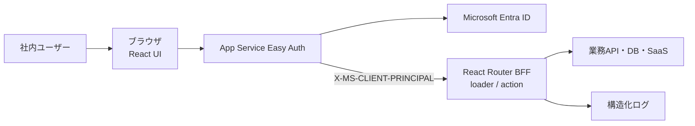

# アーキテクチャ

## 方針

このアプリは、ブラウザ、App Service Easy Auth、React Router BFF、データサービスを
基本とします。初回表示はSSR、以後の画面遷移はクライアント側で行います。



## 境界

### ブラウザ

- 表示と入力を担当する
- APIキー、client secret、アクセストークンを保持しない
- 画面の非表示だけで権限を制御しない

### React Router

- Easy Authが検証したprincipalを取得し、業務認可を行う
- loaderで読み取り、actionで更新を行う
- 外部APIの資格情報をサーバー環境変数から取得する
- 入力検証、認可、監査ログを行う

### 外部サービス

- 業務データの正本を保持する
- React Routerから最小権限でアクセスする

## 認証・ユーザーコンテキスト

1. 未認証ユーザーが`POST /auth/login`を実行する。
2. アプリは安全な戻り先を付けて`/.auth/login/aad`へリダイレクトする。
3. Easy AuthがEntra IDとのOIDCフローとセッションCookieを管理する。
4. 認証済み要求にBase64 JSON形式の`X-MS-CLIENT-PRINCIPAL`を付加する。
5. React RouterはZodでprincipalを検証し、`oid`、`tid`、`roles`、`groups`、表示名、
   メールアドレスを抽出する。
6. `tid`を構成済みtenantと照合し、`roles`と所有者IDで各操作を認可する。

アプリ独自の本番セッションCookie、MSAL、client secret、callback routeは持ちません。
Microsoft Graphは呼ばず、Easy AuthのToken Storeも無効にします。ログアウトはアプリの
同一オリジン検証済みPOST actionから`/.auth/logout`へ遷移します。

`roles`は`User`・`Admin`の業務認可に使います。`groups`は複数値を前提とした所属コードで、
画面表示と監査時点情報に使います。特定のグループ名を操作権限へ直接対応付けません。
有効なApp Roleまたは所属クレームがない場合、アプリはfail closedで拒否します。
グループoverageは`hasgroups`、`_claim_names`、`_claim_sources`、`groups.link`の
claim typeで検出して403で拒否し、Graphへ自動fallbackせずEntra側の割り当てを是正します。

認証・認可のモジュールは次のとおり分けます。

- `app/lib/auth/easy-auth.server.ts`: principalのBase64・JSON・Zod検証、claim type
  allowlist、`tid`照合、group overage検出
- `app/lib/auth/roles.server.ts`: `User`・`Admin` App Roleの判定(未知のrole値は無視)
- `app/lib/auth/authorization.server.ts`: owner・admin判定と資料単位の閲覧・削除認可
- `app/lib/session.server.ts`: `getUser`・`requireUser`とローカル開発専用セッション

認可はloader、action、データアクセス直前でこれらを呼び出し、UIの非表示を認可として
扱いません。拒否結果は監査の`error_category`(`not_authenticated`・`not_authorized`・
`document_not_found`)と対応付けます。

ローカル開発だけは`AUTH_MODE=dev`の署名付きCookieを使います。本番では
`AUTH_MODE=easyauth`を必須とし、クライアントが任意に送ったprincipal headerを信頼できる
経路を作りません。

## 適用範囲

向いている用途:

- 認証付きCRUD
- 社内管理画面
- 外部API連携
- 生成AI・RAGのフロント/BFF
- 小規模なワークフロー

別バックエンドを検討する用途:

- 長時間バッチ
- ジョブキュー
- 多数のシステムから共用されるAPI
- 大量データ処理
- 複雑なトランザクション

## 「資料みて！」固有の実行境界

アップロードされたHTMLは信頼せず、アプリ本体とは別オリジンのHTML表示サービスで
配信します。Easy AuthのセッションCookieは表示サービスへ送らず、対象資料、操作利用者、
有効期限を限定した60秒有効のEd25519署名付き表示grantでアクセスを制御します。
grantはアプリJavaScriptがhidden formのPOST bodyでiframeへ送り、URL、Cookie、ログへ
含めません。JavaScript無効時の表示fallbackは設けません。

- HTMLは改変せず、`html/{documentId}/document.html`のprivate Blobとして保存する
- 表示サービスはNode.js標準HTTPサーバーとし、`GET /health`と`POST /display`だけを持つ
- 表示サービスはBlob取得後に閲覧監査を書き、成功してからHTMLを返す
- CSPとsandboxでJavaScript、外部resource、フォーム、ダウンロード、状態保存を無効化する
- `meta refresh`、`base href`、ページ内以外の相対リンク、`data:`、`file:`、
  独自schemeのリンクを含むHTMLは保存前に拒否する
- `http:`、`https:`、ページ内リンクは確認routeへ置き換えない
- 通常リンクはiframe内、`_blank`は新しいタブで開き、`_top`と`_parent`は無効化する
- リンククリック単位の監査とリンク専用データモデルは設けない

WebだけをLinux App Serviceで実行し、Easy Authを有効にします。プレビュー生成はChromiumを
含む別imageのQueue駆動Container Apps Jobで最大3回試行し、JavaScriptと外部ネットワークを
無効化します。Display、Migration、MaintenanceもContainer Appsで実行します。

## データとAzure境界

- PostgreSQLには`pg`で接続し、loader/action、service、repositoryへ分離する
- migrationは`node-pg-migrate`と専用Managed Identityを使い、runtimeへDDL権限を与えない
- HTMLとJPEG previewはprivate Blob、非同期通知はStorage Queueへ保存する
- Web、Display、Preview、Migration、Maintenanceは用途別Managed Identityを使う
- 秘密情報はKey Vault参照で環境変数へ渡し、アプリからKey Vault APIを直接呼ばない
- production、stagingともJapan Eastの単一region、LRS、非ゾーン冗長とする
- applicationとdata planeはprivate networkへ限定する
- ACRだけはGitHub-hosted runnerのpush用に認証付きpublic endpointを使う

Infrastructure as CodeはBicep、CI/CDはGitHub ActionsのOIDCを使います。GitHub-hosted
runnerからprivate data planeへ直接接続せず、migrationとsmoke testはVNet内の
Container Apps Jobとして実行します。production DB migrationはforward-onlyかつ
新旧applicationに互換とし、application rollback時にdown migrationは行いません。
詳細は`docs/APPLICATION_DESIGN.md`で定義します。

## DBマイグレーション(`migrations/`)

`migrations/`配下に`node-pg-migrate`用のSQL形式migrationを置き、`npm run db:migrate`
(`node-pg-migrate up`)で`public`schemaへ適用します。forward-onlyとし、
`-- Down Migration`セクションは書きません(node-pg-migrateはセクションが無い
migrationを`down`実行不可として扱うため、誤ってdown migrationを実行することを
防げます)。破壊的変更が必要な場合は新しいmigrationファイルを追加し、複数リリースへ
分けます(設計 §7.4)。

- `documents`: 資料メタデータ(設計 §12.1)。`status`(`active`/`deleted`)と
  `preview_status`(`pending`/`ready`/`failed`)はCHECK制約で値域を制約し、
  `status`と`deleted_at`の整合性もCHECK制約で担保します(設計 §11.1の状態モデル)。
  削除時に消去する項目(`owner_email_at_upload`、`original_file_name`、`title`、
  `byte_size`、`preview_status`、`warning_codes`)はNULL許容にします。所有者別の
  新しい順一覧(`owner_subject_id, created_at DESC`)と、管理画面検索
  (`created_at`、`owner_email_at_upload`、`original_file_name`)向けのindexを
  持ちます(設計 §5.2, §5.6)。
- `audit_events`: 監査イベント(設計 §12.2)。`action`・`result`はCHECK制約で
  値域を制約し、`retain_until`(1年後の削除予定日時、設計 §16)は`occurred_at`から
  `BEFORE INSERT` triggerで機械的に計算します(`timestamptz + interval`は
  timezoneに依存しIMMUTABLEでないため、GENERATED列にはできません)。
  **追記専用**: `BEFORE UPDATE OR DELETE` triggerがDB roleの設定に関わらず
  `RAISE EXCEPTION`するため、通常のアプリ操作からUPDATE・DELETEできません
  (設計 §12.2)。1年経過後のpurgeなど正当な運用作業だけが、テーブル所有者相当の
  権限で`ALTER TABLE audit_events DISABLE TRIGGER audit_events_append_only`を
  一時的に使う想定です(Maintenance Jobの具体的な手順は別タスクで設計します)。
  `document_id`は資料へのFK(`ON DELETE`指定なし)ですが、検証・保存失敗時の
  監査は資料レコード自体を作らないため`document_id`を持ちません(設計 §11.1)。
- runtime用DB role(`siryou_mite_runtime`という名前を仮定)には、`documents`へ
  SELECT/INSERT/UPDATEだけ、`audit_events`へSELECT/INSERTだけを与えます(削除は
  `documents.status`の更新で表すsoft deleteのため、DELETEはどちらにも与えません)。
  Managed Identityと対応付けるDB roleの実際の作成・用途別分割(Web/Display/Preview/
  Maintenanceを分けるか)はIaC(Bicep)側の別タスクの範囲とし、このmigrationは
  roleが存在する場合だけGRANTし、存在しない環境(ローカル・CI)では何もしません。
- keyset paginationのタイブレーカ`id DESC`を含むindex
  (`documents (owner_subject_id, created_at DESC, id DESC)`、
  `audit_events (occurred_at DESC, id DESC)`)を追加し、前方一致で完全に代替される
  既存indexを削除する migration を追加しています(forward-only。既存migrationファイルは
  書き換えません)。
- `upload_attempts`: アップロード試行の記録(設計 §6.1の頻度・同時実行・容量制限)。
  「1分あたりの回数」と「進行中のアップロード」は既存テーブルに残りません(検証で
  拒否したアップロードは資料レコードを作らないため。設計 §11.1)。Redisなどを追加
  しない方針(設計 §6.1)のため、PostgreSQLの1テーブルで表します。進行中は
  `finished_at IS NULL AND expires_at > now()`で表し、明示的な解放が行われないまま
  処理が異常終了しても`expires_at`で自動的に失効します。上限判定と資料登録は別
  トランザクションで行われる(設計 §10.1)ため、`byte_size`(予約byte数)も保持し、
  件数・容量の判定では`documents`の集計に進行中の予約分を加算します(加算しないと
  並行アップロードが同じ集計値を見て全て許可され、システム全体50GB・利用者500MBを
  超過できます)。保存するのは`owner_subject_id`(Entraのoid)・時刻・byte数だけで、
  ファイル名・HTML本文は持ちません。runtime roleへはSELECT/INSERT/UPDATEだけを与え、
  古い行のpurgeはMaintenance Job側の運用作業とします(設計 §7.7)。集計は
  `documents (owner_subject_id) INCLUDE (byte_size) WHERE status = 'active'`と
  `upload_attempts (expires_at) INCLUDE (byte_size) WHERE finished_at IS NULL`の
  部分indexで、システムロック保持中の集計を短く保ちます。

結合テスト(`tests/integration/`、`npm run test:integration`)は、専用schemaへ
migrationを適用してテーブル・カラム・型・制約・index・追記専用triggerを検証します。
ローカルPostgreSQLへの実接続が必要なため、`npm run test`・`npm run verify`には
含めません(GitHub ActionsでPostgreSQL service containerを使う設定が別途必要です)。
結合テストは`DATABASE_URL`のhostが`postgres`・`localhost`・`127.0.0.1`などローカルの
場合だけ実行します(schemaとテスト用roleをDROPするため、本番・共有DBへ向いた設定では
fail closedで停止します。設計 §18.2)。

## DB接続とrepository層(`services/shared/db/` と `app/lib/db/`)

loader/action、service、repositoryを分離し、SQLはrepositoryの中だけに置きます
(設計 §7.4)。ORMは導入しません。

DBはWebだけでなくDisplay(閲覧監査と`active`再確認)・Preview・Maintenanceも触るため、
**SQLとZod schemaの実処理は`services/shared/db/`へ集約**し、`app/lib/db/*.server.ts`は
そこを再exportする薄いラッパーにしています(`services/shared/storage.ts`と
`app/lib/storage.server.ts`の関係と同じ形)。`services/`配下は`app/`をimportできない
(`tsconfig.services.json`の`rootDir: services`)ため、この形にしないとSQLと
`error_category`のenumが二重管理になり、契約が食い違います。依存方向は
`app/` → `services/shared/`の一方向のみです。

- `services/shared/db/pool.ts`: `pg`のPoolを作る実処理です。接続数上限、idle/接続
  timeout、statement timeoutは`poolSettings`に固定し、環境変数では変更できないように
  しています(環境ごとの設定ミスでDB接続が枯渇しないため)。**このモジュールは環境変数を
  読みません**。接続文字列・`application_name`・TLS要求の有無は`createDatabasePool()`の
  引数で受け取り、Webは`app/lib/env.server.ts`から、Displayなどは
  `services/<name>/env.ts`から渡します(`application_name`は実行単位ごとに変え、DB側で
  識別できるようにします)。productionではTLS証明書検証を有効にしたTLS接続を要求します。
  idle接続のエラーは分類(SQLSTATE)だけを記録し、接続文字列や資格情報はログへ出しません。
- `app/lib/db/pool.server.ts`: Web向けの薄いラッパーです。プロセス内で使い回すPoolの
  キャッシュ(`getPool()`・`withTransaction()`・`closePool()`)だけをWeb固有に持ちます。
- `withTransaction(run)`は業務更新と監査を同じトランザクションで保存するために使います
  (監査保存に失敗した操作は成功させない。設計 §15.1)。repositoryの各関数は
  `Queryable`(Pool・transaction中のclientの共通interface)を引数に取り、
  トランザクションの内外から同じ関数を呼べます。
- `services/shared/db/documents.ts`: 資料メタデータのrepositoryです。値は必ず
  プレースホルダーで渡します。所有者スコープが必要な操作は所有者IDを必須引数にした
  専用関数(`listDocumentsByOwner`、`deleteDocumentAsOwner`)として公開し、
  管理者の強制削除だけを別関数(`deleteDocumentAsAdmin`)にして、所有者条件の
  渡し忘れが起きない形にしています。認可判定自体はloader/action側で行います。
- 一覧はoffsetを使わないkeyset paginationです。`(created_at DESC, id DESC)`で並べ、
  cursorは`(created_at, id)`をbase64urlへ符号化しただけの位置情報です。cursorは署名
  しませんが、SQLが常に`owner_subject_id`で絞り込むため、改ざんしても他人の資料は
  返りません。壊れたcursorはZod検証で拒否します。監査履歴も同じ方式で
  `(occurred_at DESC, id DESC)`に並べますが、cursorには`Date`(ミリ秒まで)ではなく
  DBから取り出したマイクロ秒精度の文字列を使い、同じミリ秒に発生した監査イベントを
  取りこぼさないようにしています。監査履歴のcursorも位置情報だけで、閲覧できるのは
  `requireAdmin`を通ったloaderに限られます。
- `services/shared/db/audit-events.ts`: 監査イベントのrepositoryです。**INSERTと、
  監査履歴画面(設計 §5.7の`/admin/audit`)が使うSELECTだけ**を公開し、UPDATE・DELETEを
  行う関数を持ちません(DB側でもtriggerとrole権限で禁止)。監査履歴の検索は日時・
  利用者・資料ID・操作・結果で絞り込み、`action`・`result`はINSERTと同じZod enumに
  限ります(enum外の値はDBへ渡しません)。
  入力はZodのstrict objectで検証し、設計 §12.2に無い項目(HTML本文、ファイル名、
  token、表示grant、Cookie、principal header、IPアドレスなど)は型にも実装にも
  存在しないため保存できません。`error_category`はDBでは自由記述TEXTですが、
  repository側で固定の分類(Zod enum)に閉じ、エラーメッセージや外部サービス応答が
  そのまま保存されないようにします。`occurred_at`はDBの`now()`だけを使い、
  呼び出し側から指定できません(発生日時の偽装と保持期間の引き延ばしを防ぐため)。
- `services/shared/db/`のrepository関数は`executor`(`Pool`またはtransaction中の
  `PoolClient`)を**必ず引数で受け取り**、既定値を持ちません(Pool生成が環境変数に
  依存するため)。「省略時は`getPool()`」というWeb向けの既定値は、読み取り系だけ
  `app/lib/db/documents.server.ts`のラッパーで足しています。更新系と監査INSERTは
  Web側でも既定値を持たせず、業務更新と同じ`tx`の渡し忘れを型エラーにします
  (設計 §15.1)。
- `app/lib/db/upload-limits.server.ts`: Web専用のためservicesへは移していません。 アップロード上限(件数・容量・頻度・同時実行)の
  判定です(設計 §6.1, §10.1(3))。1つのトランザクションの中で、利用者単位の
  `pg_advisory_xact_lock`→集計→システム全体の`pg_advisory_xact_lock`(upload判定の
  直列化)→集計→`upload_attempts`への登録、の順に実行します。advisory lockは
  transaction有効期間のため、commit・rollback・接続断のいずれでも必ず解放されます。
  ロックキーは、用途ごとの固定文字列(`siryou-mite/upload-limits/owner`、
  `.../system`)のSHA-256先頭4byteをnamespace(第1キー)とし、利用者側の第2キーは
  `owner_subject_id`のSHA-256先頭4byteとします(advisory lockはDB cluster全体で
  共有されるため名前空間を分け、`pg_locks`から利用者識別子が読めないようにします)。
  ロックの取得順は「利用者→システム」に固定してデッドロックを避け、待ち時間は
  `SET LOCAL lock_timeout`(既定5秒、`poolSettings.statementTimeoutMillis`以下)で
  打ち切り、取得できない場合は待ち続けずに拒否(`lock_wait_timeout`)を返します。
  件数・容量の集計には、まだ`documents`へ登録されていない進行中の試行の予約分
  (`upload_attempts.byte_size`と進行中件数)を必ず加算します。資料登録commitの後・
  解放の前は同じbyte数が両方に現れますが、常に安全側(多め)へ倒れます。呼び出し側
  (T09)は判定時にbyte数を渡し、資料登録をcommitした**後**に
  `releaseUploadSlot({ attemptId, ownerSubjectId })`で解放します(解放は所有者で
  絞り込み、他人の試行を解放できないようにしています)。判定本体
  (`reserveUploadSlotWithin`)の引数は`runInTransaction`と同じ理由で`PoolClient`に
  限定し、`getPool()`を渡してadvisory lockが文ごとに解放される誤用を型で防ぎます。
  判定結果は拒否理由を区別でき、監査の`error_category`(`quota_exceeded`/
  `rate_limited`)への対応も同じmoduleで持ちます。上限値はすべて
  `app/lib/env.server.ts`(設計 §6.1「制限値は環境設定で変更可能」)から読み、
  呼び出し側から上書きできます。

## ディレクトリ構成とTypeScript build(Web / Display / Preview / Maintenance)

5つのAzure実行単位（Web、Display、Preview Job、Migration Job、Maintenance Job）のうち、
React Router Web以外はReact Routerに依存しない独立したNode.jsスクリプトとして実装します。
これらは`app/`とは別のtree（`services/`）に置き、build成果物も分離します。

```text
app/                      Web（React Router、SSR）。react-router buildでbuild/へ出力
  lib/env.server.ts       Web用環境変数schema(Zod)
services/
  shared/env.ts           Display/Preview/Maintenance共有の環境変数検証ヘルパー(Zod)
  shared/storage.ts       Blob/Queueクライアントの実処理(Web・Display・Preview・Maintenanceで共有)
  shared/grant.ts         表示grantの署名・検証(Web=署名、Display=検証で共有)
  shared/log.ts           運用ログ(1行1event JSON)の実処理。Web・各serviceで共有
  shared/db/pool.ts       pg Poolの生成・トランザクション(環境変数は読まない)
  shared/db/documents.ts  documents repository(SQL・Zod schema)
  shared/db/audit-events.ts  audit_events repository(追記専用)
  display/index.ts        Display（HTML表示サービス）のエントリーポイント(環境変数検証と起動のみ)
  display/server.ts       Displayのnode:http ハンドラー(経路・Origin・body上限・grant検証・監査)
  display/headers.ts      表示レスポンスのCSP・sandbox(設計 §9.2)
  display/dependencies.ts DisplayのDB・Blobクライアント組み立て
  display/env.ts          Display用環境変数schema
  preview/index.ts        Preview Job（プレビュー生成ワーカー）のエントリーポイント(環境変数検証・Job実行上限・終了コード)
  preview/worker.ts       1実行1メッセージの処理手順(dequeueCount判定・冪等性・失敗分類)
  preview/capture.ts      Playwright(Chromium)での撮影と安全設定(sandbox有効・JS無効・通信遮断)
  preview/dependencies.ts PreviewのQueue・DB・Blob・撮影の組み立て
  preview/env.ts          Preview Job用環境変数schema
  maintenance/index.ts     Maintenance Job（定期保守）のエントリーポイント
  maintenance/env.ts      Maintenance Job用環境変数schema
tsconfig.services.json    services/専用のTypeScript設定。build/services/へ出力
Dockerfile                Web・Display・Migration・Maintenance共通のNode.js image
Dockerfile.preview        Preview Job専用image（Playwright公式Ubuntu image + Chromium）
```

- `services/<name>/index.ts`をコンテナのentrypointとし、Web・Migration・Maintenanceと
  同じNode.js用Docker imageから`node build/services/<name>/index.js`を異なるcommandで
  起動する想定にする（設計 §7.6）。Preview Jobだけは別途Chromiumを含む専用image
  (`Dockerfile.preview`、Playwright公式Ubuntu imageを`@playwright/test`と同じversionで固定)を
  使う。imageは合計2種類。
- `tsconfig.services.json`は`app/`を含めず、Node.js 24のESM(`module`/`moduleResolution`:
  `NodeNext`)、`strict`、`outDir: build/services`で完結する。ルートの`tsconfig.json`は
  `services`と`build`を`exclude`し、Web側のtypecheckと設定が混ざらないようにする。
- 環境変数のZod schemaはWeb用(`app/lib/env.server.ts`)とservice用
  (`services/display|preview|maintenance/env.ts`)で分離する。`services/`配下は
  `app/`を一切importしない方針のため、共有したい検証ロジック(base64鍵検証、
  Ed25519 PEM検証、DATABASE_URL、Storage接続設定など)は`services/shared/env.ts`へ
  切り出し、`services/<name>/env.ts`はそこから部品を読み込んで固有schemaを組み立てる。
  Web側とservices側で検証ヘルパーの実装が一部重複するが、`tsconfig.services.json`の
  `rootDir: services`制約により`app/`をimportできないための意図した重複とする。
- サービス間で共有したいコード（DB接続、Blob/Queueクライアント、運用ログなど）が
  増えた場合も同様に`services/shared/`へ追加する。Display(`services/display/`)は実装済みで、
  Display(`services/display/`)とPreview(`services/preview/`)は実装済みで、
  Maintenanceの`index.ts`は引き続き起動確認用の最小実装（担当タスクを示すコメント付き）
  であり、業務ロジックはT19で追加する。
- Dockerfileのbuild stageは`npm run build`（Web）に続けて`npm run build:services`を
  実行し、`build/client`・`build/server`・`build/services`を同じimageへ入れる（設計 §7.6:
  Web・Display・Migration・MaintenanceでNode.js imageは1種類）。実行単位の切り替えは
  起動commandだけで行い、非rootコンテナ（`USER node`）は変更しない。
- `services/shared/storage.ts`（Blob Storage / Storage Queueクライアント、設計 §7.3,
  §7.5）はWeb・Display・Preview・Maintenanceすべてで使う実処理のため、Web専用の
  `app/lib/env.server.ts`のように重複させず、ここへ集約する。依存方向は
  `app/` → `services/shared/`の一方向のみとし、`services/`配下（`shared/`含む）が
  `app/`をimportすることは無い。Web側は`app/lib/storage.server.ts`から本モジュールを
  再importする薄いラッパーとして参照し、`app/lib/env.server.ts`（Zod検証済み環境変数）
  からclientを組み立てる部分だけをWeb固有に持つ。
  - Azure SDKの既定の`x-ms-version`はSDKバージョンに追随して自動的に上がるため、
    `services/shared/storage.ts`の`AZURE_STORAGE_API_VERSION`定数でpipeline policy経由
    ヘッダーへ固定している（`options.version`では固定できない、SDKの既知の制約）。
    `@azure/storage-blob`/`@azure/storage-queue`を更新したときは、Azuriteが対応する
    APIバージョンとこの定数を合わせて見直す。
- `services/shared/grant.ts`（表示grantの署名・検証、設計 §7.2, §9.5, §10.3）はWebと
  Displayを**跨ぐ契約**のため、`services/shared/storage.ts`と同じ理由でここへ集約する。
  実装を二重に持つと署名対象のbyte列が食い違って表示が壊れるため、形式を変える変更は
  必ず本モジュールだけで行う。
  - 形式は`<header>.<payload>.<signature>`の3セグメント（すべてbase64urlのため、
    hidden formの`application/x-www-form-urlencoded` POST値として安全）。
  - 署名対象のbyte列は`siryou-mite/display-grant/v1.<header>.<payload>`の
    ASCII文字列で、先頭の固定contextはdomain separation（同じ鍵が他用途の署名へ流用された
    場合の取り違え防止）。セグメントは`.`を含まない文字集合のため区切りの解釈は一意。
  - `header`は`alg`（Ed25519固定）・`typ`・`kid`を持ち、署名対象に含まれる。Displayは
    `kid`で`GRANT_VERIFICATION_KEYS`から公開鍵を引くため新旧2鍵を併用してrotationでき、
    未知の`kid`はfail closedで拒否する（設計 §9.5）。`kid`のすげ替えは署名検証で落ちる。
  - 鍵の配置はWebが署名用のEd25519**秘密鍵のみ**、Displayが検証用の**公開鍵のみ**
    （設計 §9.5）。Webは`app/lib/grant.server.ts`（`app/lib/env.server.ts`から署名鍵を
    組み立てる薄いラッパー）だけを使い、検証系APIは再exportしない。Displayは
    `services/shared/grant.ts`を直接importする。
  - payloadに入れてよいのは資料ID・`oid`・tenant ID・操作時点のメールアドレス・
    `iat`/`exp`・nonceだけで、Blobキーとファイル名は含めない（設計 §7.2）。grant・鍵・
    nonceはログへ記録しない（設計 §9.5）。
- `npm run verify`は`typecheck`（Web）→`typecheck:services`→`test:coverage`→`build`
  （Web）→`build:services`の順に実行し、Web側の既存手順を壊さない。

## HTML表示サービス(`services/display/`)

アップロードされたHTMLは、アプリ本体とは別オリジンのDisplayだけが配信します
(設計 §7.2, §9.2, §10.3)。Node.js標準の`node:http`で実装し、Express等のHTTP
frameworkは追加しません。

- 公開するのは`GET /health`と`POST /display`だけです。pathが違えば404、pathが同じで
  methodが違えば405(`Allow`付き)で拒否します。`POST /display`にクエリ文字列が付いた
  要求は、内容を読まずに400で拒否します(grantをURL・クエリ文字列で受け取らないため。
  ingressログへ値が残る経路を作りません)。Cookieヘッダーは読まず、使いません。
- `Origin`がアプリオリジン(`APP_ORIGIN`)と完全一致しない要求は、欠落も含めて拒否します
  (fail closed)。`Content-Type`は`application/x-www-form-urlencoded`だけを受け付けます。
- POST bodyは`DISPLAY_MAX_POST_BODY_BYTES`(既定8KB)を**streaming中に超えた時点で
  打ち切り**、それまでのchunkも破棄します(`Content-Length`の事前検査も行いますが、
  ヘッダーが無い場合に備えて上限判定は必ずstreaming側でも行います)。
- grantの検証は`services/shared/grant.ts`の`verifyDisplayGrant`に集約しています。起動時に
  `GRANT_VERIFICATION_KEYS`から検証鍵の索引を1回だけ作り、要求ごとに署名・`typ`・`kid`・
  期限・有効期間上限を検証します。**有効期限内のgrantの再利用は許容**します(設計 §18.2
  「60秒以内の再利用」の解釈。iframeのリロードで同じgrantが再POSTされるため)。使用済み
  nonceは保存しません。
- 対象資料は**署名済みpayloadの`documentId`だけ**から決めます。POST bodyの他の項目は
  読みません。
- grantが有効でもDBで`status = 'active'`を再確認し、未存在・削除済みは同じ404
  (「資料が見つかりません」)として拒否します(設計 §10.4)。
- 処理順は「`active`確認 → Blob取得 → 閲覧監査INSERT → HTML返却」で、**監査を保存
  できなかった場合はHTMLを返しません**(設計 §10.3(6), §15.1)。拒否(`denied`)・失敗
  (`failed`)も監査へ残します。Displayは業務更新を行わないため、監査は単独INSERT
  (Poolの自動commit)で保存します。
- **grantの署名検証が通らなかった場合は監査を残しません**。`audit_events`は
  `actor_subject_id`・`actor_tenant_id`が必須の追記専用テーブルで、署名が壊れているgrantの
  利用者情報は信用できないためです(検証していない値を監査へ書くと、到達できる相手なら
  誰でも任意の識別子で追記でき、監査の信頼性と容量を毀損します)。代わりに運用ログへ
  相関IDとエラー分類(`grant_invalid`/`grant_expired`)だけを記録します。T04 Q-014と
  同じ考え方です。
- レスポンスヘッダーは`services/display/headers.ts`に集約し、設計 §9.2 のCSPをそのまま
  組み立てます。資料HTMLとアプリのiframe内に表示する短いエラー画面は
  `frame-ancestors <APP_ORIGIN>`、health・許可外経路・Origin不正のレスポンスは
  `frame-ancestors 'none'`です。アプリ本体用の`X-Frame-Options: DENY`は流用しません
  (設計 §9.2)。あわせて`Cache-Control: no-store`、`Referrer-Policy: no-referrer`
  (grant漏えい対策、設計 §9.4)、`X-Content-Type-Options: nosniff`を付けます。
- ログにはgrant、POST body、メールアドレス、HTML本文、ファイル名を出しません(設計 §9.5)。
  出すのは相関ID・処理名・成否・エラー分類・HMAC化した`oid`・資料IDだけで、
  `services/shared/log.ts`の共通実装を使います。相関IDは`X-Correlation-Id`レスポンス
  ヘッダーとエラー画面にも出します(設計 §14, §15.2)。
- 外部呼び出しにはtimeoutを設定します。Blob取得は`abortSignal`(5秒)、DBは
  `poolSettings`のstatement/query timeout、HTTPは`requestTimeout`・`headersTimeout`です。
- HTTP処理(`server.ts`)は外部I/Oを`DisplayDependencies`として受け取るため、単体テストでは
  偽のDB・Blobで実サーバーを立てて経路・ヘッダー・上限を検証し、結合テスト
  (`tests/integration/display-service.test.ts`)では本番と同じ組み立て
  (`createDisplayRuntime`)で実PostgreSQL・Azuriteへ接続して検証します。

## プレビュー生成ワーカー(`services/preview/`)

プレビュー画像は、Storage Queueのメッセージを1実行1件だけ処理するContainer Apps Jobで
生成します(設計 §7.5, §10.2)。Chromiumを含む専用image(`Dockerfile.preview`)で動く
唯一の実行単位です。

- 責務を3つに分けています。`index.ts`が環境変数検証・Job実行上限(45秒)・終了コード、
  `worker.ts`が処理手順と判定(外部I/Oはすべて注入)、`capture.ts`がPlaywright(Chromium)
  での撮影、`dependencies.ts`がQueue・DB・Blob・撮影の組み立てです。Displayと同じ構成で、
  結合テストは本番と同じ`createPreviewRuntime`を通ります。
- 受信は1件だけ(`numberOfMessages: 1`、visibility timeout 60秒)。メッセージは
  `schemaVersion`と`documentId`だけをstrictに検証します。**検証できない本文でも
  `messageId`・`popReceipt`は返す**`receivePreviewGenerationEnvelopes`を
  `services/shared/storage.ts`へ追加し、資料IDの分からないメッセージをqueueから
  取り除けるようにしています(削除しないと最大7日間再配信され続けるため)。
- `dequeueCount`で試行回数を判定します。1・2回目の失敗は**メッセージを削除せず**
  再配信に任せ、3回目(上限)の失敗で`preview_status`を`failed`にし、監査を保存してから
  削除します。上限を超えた配信(前回の`failed`更新前に落ちた場合など)では撮影せずに
  `failed`にします。専用の失敗キューは設けません(設計 §7.5)。
- 冪等性: 資料が未存在・削除済み(`preview_status IS NULL`)、または`pending`以外
  (`ready`・`failed`)の場合は**撮影せずメッセージを削除**します。Blobキーは資料IDから
  決定的に導出するため再撮影しても上書きになり、メッセージ削除も冪等です。撮影中に資料が
  削除されて`ready`更新が0行になった場合は、保存したプレビューBlobを削除して孤児を残しません。
- 撮影(`capture.ts`)は設計 §7.5 の必須条件をコードで固定します。**Chromium sandbox有効**
  (`chromiumSandbox: true`。Playwrightの既定は`false`のため明示が必須)、**JavaScript無効**
  (`javaScriptEnabled: false`)、**service worker無効**(`serviceWorkers: "block"`)、
  1280x720 viewport、`fullPage: false`、`animations: "disabled"`、`omitBackground: false`
  (白背景)、描画timeout10秒です。`--no-sandbox`などsandboxを弱める引数は
  `assertSandboxArguments`が起動前に拒否します(fail closed)。
- **外部ネットワーク接続の遮断は4重**です。(1)HTMLは`page.setContent`で流し込み、
  ページ取得にネットワークも`file://`も使わない (2)context単位の`route("**/*")`で
  すべてのsubresource要求を`abort`する (3)context を`offline: true`にする
  (4)JavaScript無効でスクリプト経由の通信を発生させない。加えてChromium起動引数で
  telemetry・component update・Safe Browsingの背景通信を止めます。本番ではネットワーク側でも
  egressを禁止します(設計 §8)。実際に遮断されることは、ローカルHTTPサーバーが撮影中に
  1件も要求を受けないことで結合テストが確認します。
- **メッセージ削除の失敗で業務結果を巻き戻しません**。`ready`更新後に削除だけ失敗した
  場合にそれを処理全体の失敗として扱うと、試行上限に達していれば成功済みのプレビューを
  `failed`へ書き換えてしまいます。削除失敗は分類だけを運用ログへ残し、再配信されたときに
  `pending`以外の資料として撮影せず削除します。
- 多重timeout: 描画10秒(`capture.ts`) < 1メッセージの処理上限30秒(`withProcessingDeadline`)
  < Job実行上限45秒(`index.ts`) < visibility timeout 60秒。環境変数schema(`env.ts`)が
  検証するのは**処理上限 + 後始末の見込み(`PREVIEW_FINALIZE_BUDGET_SECONDS`)が
  Job実行上限とvisibility timeoutの両方に収まること**で、満たさない設定ではJobが
  起動しません(fail closed)。恒久失敗の記録は処理上限を使い切ったあとに走るため、
  処理上限 = visibility timeout のような等号の設定は許しません(popReceipt失効後に
  書き込みが走り、同じメッセージが別の実行へ再配信される窓が開くため)。描画timeoutと
  起動timeout(15秒)はschemaの対象外で、`capture.ts`の定数です。
- 処理上限の`AbortSignal`は`processMessage`から各段階(`step`)と各依存呼び出し
  (DB検索・HTML取得・撮影・プレビュー保存・状態更新)へそのまま渡します。Blob/Queue操作は
  `StorageOperationOptions.abortSignal`で操作単位のtimeoutと併用し、撮影は中断時に
  Chromiumを閉じます。DB呼び出しはsignalでは中止できないため、poolの
  `statement_timeout`・`query_timeout`で打ち切ります。
- **結果が確定したあとの書き込みには処理上限のsignalを使いません**。恒久失敗の記録
  (`failed`と監査)、メッセージ削除、孤児プレビューの削除は、期限切れ後でも実行しないと
  資料が`pending`のまま残る・メッセージが再配信され続ける・孤児Blobが残るため、
  `PREVIEW_FINALIZE_TIMEOUT_MS`(10秒)の独立したsignalで行います。処理上限の意味は
  「期限を過ぎてから**新しい撮影・業務処理**を始めない」ことです。DB書き込みは
  `AbortSignal`で中断できないため、実際に効くのはpoolの`query_timeout`(12秒)です
  (`PREVIEW_FINALIZE_BUDGET_SECONDS`はこの大きい方を採ります)。
- **確定した`ready`を後続の配信が`failed`で上書きしません**。`updateDocumentPreviewStatus`の
  UPDATEは`failed`を`preview_status = 'pending'`の資料にだけ書き、更新0行なら
  `recordPreviewResult`が`false`を返して`failPermanently`は状態も監査も変えずに
  メッセージだけ削除します(`skipped`)。`ready`確定後に削除だけ失敗し続けて
  `dequeueCount`が上限を超えた配信が届いても、Blobにあるプレビューが代替画像へ
  落ちません(設計 §11.1、§15.1)。
- 監査は`action = upload`(アップロード処理の続き)として、`preview_status`の更新と
  **同じトランザクション**で保存します(設計 §15.1)。`audit_events`の
  `actor_subject_id`・`actor_tenant_id`はNOT NULLでワーカーには操作者がいないため、
  同じ資料のアップロード監査から引き継ぎます(Q-040)。メールアドレス・所属・App Roleは
  引き継がず`null`にします。
- ログに出すのは固定の`event`名・成否・エラー分類(`preview_timeout`/`preview_failed`/
  `storage_failed`/`database_failed`/`validation_failed`)・相関ID・資料IDだけです。
  HTML本文、ファイル名、プレビュー画像、Blobキー、中止した要求のURLは出しません(設計 §15.2)。

## HTML受け入れ検査(`app/lib/html/`)

アップロードされたHTMLの受け入れ可否は、I/Oを持たない純粋関数として
`app/lib/html/inspection.server.ts`の`inspectHtmlUpload()`に集約します(設計 §6, §10.1(5))。
HTMLは**書き換えず**、拒否理由コードと警告コードだけを返します。

- 上限値(サイズ、ファイル名・`title`の長さ、解析上限)は引数で受け取り、モジュール内で
  環境変数を読みません。呼び出し側(T09のアップロードaction)が`app/lib/env.server.ts`の
  `MAX_HTML_UPLOAD_BYTES`などを渡します。
- 結果コードは`app/lib/html/inspection-codes.ts`に置き、`parse5`へ依存させません
  (画面側の警告表示から読み込めるようにするため)。コードは監査・テスト・UIで
  共通に使う安定した識別子とし、利用者向けの日本語メッセージと分離します。
  値は`documents.warning_codes`(1要素100文字以内)へそのまま保存できる長さに保ちます。
- URLの判定は標準の`URL`パーサーで行い、値はHTML/URL標準と同じ前処理(前後のC0制御文字・
  空白の除去、tab・改行の除去)だけを適用します。属性値の文字参照は`parse5`が復号済みの
  ため、二重に復号しません。
- `parse5`は`scriptingEnabled: false`で解析します。表示時はsandboxでJavaScriptを
  無効化するため、`noscript`の中身もmarkupとして解釈されるためです。
- 解析量の上限(入れ子の深さ、要素数、`iframe srcdoc`の段数と合計文字数)を持ちます。
  `parse5`の終了タグ処理はopen element stackを走査するため、上限が無いと数MBの
  `<div>`の羅列だけで検査が終わりません。上限超過は`excessive_complexity`として
  拒否します(設計に無い分類。`docs/agent/QUESTIONS.md`のQ-007を参照)。
- 検査は多層防御の1層目です。inline CSSのescapeなど属性検査をすり抜けた外部resourceは、
  表示サービスのCSPとsandboxで遮断します(設計 §6.2)。

## アップロード(`app/routes/documents.ts`、`app/lib/upload/`)

`POST /documents`(設計 §13)は画面を持たないresource routeで、処理本体は
`app/lib/upload/upload.server.ts`の`handleDocumentUpload()`にあります。

- route moduleはHTTP methodの判定だけを行い、`GET`と`POST`以外は`405`を返します。
- 手順は設計 §10.1のとおり、認証(`requireUser`)→同一オリジン検証
  (`assertSameOrigin`)→上限判定(`reserveUploadSlot`)→raw bodyと`X-File-Name`の検証→
  HTML受け入れ検査(`inspectHtmlUpload`)→資料ID発行→Blob保存→DB登録(監査と同一
  トランザクション)→Queue送信→資料表示画面への案内、の順に実行します。ただし
  上限判定へ渡すbyte数は`Content-Length`ではなくstreaming上限で強制した実byte数で
  なければならないため(`docs/agent/QUESTIONS.md` Q-012)、実装順としてはbodyを
  上限付きで読み切った直後に上限判定を行います。10MBを超えるbodyはこの時点で
  中断され、DBへは触れません。
- `app/lib/upload/upload-request.server.ts`はheaderとraw bodyの検証だけを持ちます。
  `X-File-Name`はcanonicalなbase64urlだけを受け付け、UTF-8として復号できない値は
  拒否します。bodyは`ReadableStream`を読みながら累計byte数を数え、上限を超えた
  時点でstreamをcancelします(全体を読み終えてから長さを見ません)。
- 外部依存(上限判定、トランザクション、repository、Blob、Queue、資料IDの発行)は
  `UploadDependencies`として差し替えられるようにしてあります。単体テストは
  呼び出し順と補償処理を、結合テストは実PostgreSQL・Azuriteに対する同じ処理を
  検証します(テスト専用schema・containerへ向けるためにこの差し替えを使います)。
- 補償処理(設計 §10.2): DB登録に失敗した場合は保存済みの不完全なBlobを削除します
  (DBは`withTransaction`がrollbackします)。監査保存に失敗した操作は成功させません
  (設計 §15.1)。Queue送信に失敗した場合はプレビュー状態を`failed`へ更新し、資料は
  閲覧可能なまま残します。予約枠(`upload_attempts`)は資料登録をcommitした**後**に
  解放し、失敗時も必ず解放します。
- 利用者向けの応答はJSON(`message`・`correlationId`、拒否時は拒否理由コード)で、
  stack trace、Blobキー、DB情報、内部URL、外部サービス応答を含めません(設計 §14)。

## 運用ログ(`services/shared/log.ts` と `app/lib/log.server.ts`)

出力形式をWeb・Display・Preview・Maintenanceで揃えるため、実処理は
`services/shared/log.ts`の`createOperationLogger(logHmacKeyBase64)`にあり、
`app/lib/log.server.ts`は`app/lib/env.server.ts`のHMAC鍵を渡すだけの薄いラッパーです
(DB・Blobと同じ方針)。

stdoutへ1行1eventのJSONを出力します(設計 §15.2)。記録してよい項目(時刻、処理名、
成否、相関ID、エラー分類、資料ID、pseudonymize化した利用者識別子)だけを引数に取り、
HTML本文・ファイル名・メールアドレス・token・Cookie・principal・request bodyは
型として受け取れません。利用者の`oid`は`LOG_HMAC_KEY`でHMAC化してから出力します。
ログ出力自体の失敗は業務処理を止めません。
