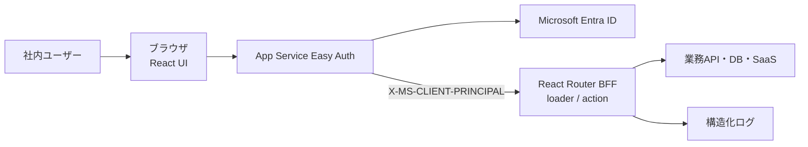

# アーキテクチャ

## 方針

このアプリは、ブラウザ、App Service Easy Auth、React Router BFF、データサービスを
基本とします。初回表示はSSR、以後の画面遷移はクライアント側で行います。



## 境界

### ブラウザ

- 表示と入力を担当する
- APIキー、client secret、アクセストークンを保持しない
- 画面の非表示だけで権限を制御しない

### React Router

- Easy Authが検証したprincipalを取得し、業務認可を行う
- loaderで読み取り、actionで更新を行う
- 外部APIの資格情報をサーバー環境変数から取得する
- 入力検証、認可、監査ログを行う

### 外部サービス

- 業務データの正本を保持する
- React Routerから最小権限でアクセスする

## 認証・ユーザーコンテキスト

1. 未認証ユーザーが`POST /auth/login`を実行する。
2. アプリは安全な戻り先を付けて`/.auth/login/aad`へリダイレクトする。
3. Easy AuthがEntra IDとのOIDCフローとセッションCookieを管理する。
4. 認証済み要求にBase64 JSON形式の`X-MS-CLIENT-PRINCIPAL`を付加する。
5. React RouterはZodでprincipalを検証し、`oid`、`tid`、`roles`、`groups`、表示名、
   メールアドレスを抽出する。
6. `tid`を構成済みtenantと照合し、`roles`と所有者IDで各操作を認可する。

アプリ独自の本番セッションCookie、MSAL、client secret、callback routeは持ちません。
Microsoft Graphは呼ばず、Easy AuthのToken Storeも無効にします。ログアウトはアプリの
同一オリジン検証済みPOST actionから`/.auth/logout`へ遷移します。

`roles`は`User`・`Admin`の業務認可に使います。`groups`は複数値を前提とした所属コードで、
画面表示と監査時点情報に使います。特定のグループ名を操作権限へ直接対応付けません。
有効なApp Roleまたは所属クレームがない場合、アプリはfail closedで拒否します。
グループoverageは`hasgroups`、`_claim_names`、`_claim_sources`、`groups.link`の
claim typeで検出して403で拒否し、Graphへ自動fallbackせずEntra側の割り当てを是正します。

認証・認可のモジュールは次のとおり分けます。

- `app/lib/auth/easy-auth.server.ts`: principalのBase64・JSON・Zod検証、claim type
  allowlist、`tid`照合、group overage検出
- `app/lib/auth/roles.server.ts`: `User`・`Admin` App Roleの判定(未知のrole値は無視)
- `app/lib/auth/authorization.server.ts`: owner・admin判定と資料単位の閲覧・削除認可
- `app/lib/session.server.ts`: `getUser`・`requireUser`とローカル開発専用セッション

認可はloader、action、データアクセス直前でこれらを呼び出し、UIの非表示を認可として
扱いません。拒否結果は監査の`error_category`(`not_authenticated`・`not_authorized`・
`document_not_found`)と対応付けます。

ローカル開発だけは`AUTH_MODE=dev`の署名付きCookieを使います。本番では
`AUTH_MODE=easyauth`を必須とし、クライアントが任意に送ったprincipal headerを信頼できる
経路を作りません。

## 適用範囲

向いている用途:

- 認証付きCRUD
- 社内管理画面
- 外部API連携
- 生成AI・RAGのフロント/BFF
- 小規模なワークフロー

別バックエンドを検討する用途:

- 長時間バッチ
- ジョブキュー
- 多数のシステムから共用されるAPI
- 大量データ処理
- 複雑なトランザクション

## 「資料みて！」固有の実行境界

アップロードされたHTMLは信頼せず、アプリ本体とは別オリジンのHTML表示サービスで
配信します。Easy AuthのセッションCookieは表示サービスへ送らず、対象資料、操作利用者、
有効期限を限定した60秒有効のEd25519署名付き表示grantでアクセスを制御します。
grantはアプリJavaScriptがhidden formのPOST bodyでiframeへ送り、URL、Cookie、ログへ
含めません。JavaScript無効時の表示fallbackは設けません。

- HTMLは改変せず、`html/{documentId}/document.html`のprivate Blobとして保存する
- 表示サービスはNode.js標準HTTPサーバーとし、`GET /health`と`POST /display`だけを持つ
- 表示サービスはBlob取得後に閲覧監査を書き、成功してからHTMLを返す
- CSPとsandboxでJavaScript、外部resource、フォーム、ダウンロード、状態保存を無効化する
- `meta refresh`、`base href`、ページ内以外の相対リンク、`data:`、`file:`、
  独自schemeのリンクを含むHTMLは保存前に拒否する
- `http:`、`https:`、ページ内リンクは確認routeへ置き換えない
- 通常リンクはiframe内、`_blank`は新しいタブで開き、`_top`と`_parent`は無効化する
- リンククリック単位の監査とリンク専用データモデルは設けない

WebだけをLinux App Serviceで実行し、Easy Authを有効にします。プレビュー生成はChromiumを
含む別imageのQueue駆動Container Apps Jobで最大3回試行し、JavaScriptと外部ネットワークを
無効化します。Display、Migration、MaintenanceもContainer Appsで実行します。

## データとAzure境界

- PostgreSQLには`pg`で接続し、loader/action、service、repositoryへ分離する
- migrationは`node-pg-migrate`と専用Managed Identityを使い、runtimeへDDL権限を与えない
- HTMLとJPEG previewはprivate Blob、非同期通知はStorage Queueへ保存する
- Web、Display、Preview、Migration、Maintenanceは用途別Managed Identityを使う
- 秘密情報はKey Vault参照で環境変数へ渡し、アプリからKey Vault APIを直接呼ばない
- production、stagingともJapan Eastの単一region、LRS、非ゾーン冗長とする
- applicationとdata planeはprivate networkへ限定する
- ACRだけはGitHub-hosted runnerのpush用に認証付きpublic endpointを使う

Infrastructure as CodeはBicep、CI/CDはGitHub ActionsのOIDCを使います。GitHub-hosted
runnerからprivate data planeへ直接接続せず、migrationとsmoke testはVNet内の
Container Apps Jobとして実行します。production DB migrationはforward-onlyかつ
新旧applicationに互換とし、application rollback時にdown migrationは行いません。
詳細は`docs/APPLICATION_DESIGN.md`で定義します。

## DBマイグレーション(`migrations/`)

`migrations/`配下に`node-pg-migrate`用のSQL形式migrationを置き、`npm run db:migrate`
(`node-pg-migrate up`)で`public`schemaへ適用します。forward-onlyとし、
`-- Down Migration`セクションは書きません(node-pg-migrateはセクションが無い
migrationを`down`実行不可として扱うため、誤ってdown migrationを実行することを
防げます)。破壊的変更が必要な場合は新しいmigrationファイルを追加し、複数リリースへ
分けます(設計 §7.4)。

- `documents`: 資料メタデータ(設計 §12.1)。`status`(`active`/`deleted`)と
  `preview_status`(`pending`/`ready`/`failed`)はCHECK制約で値域を制約し、
  `status`と`deleted_at`の整合性もCHECK制約で担保します(設計 §11.1の状態モデル)。
  削除時に消去する項目(`owner_email_at_upload`、`original_file_name`、`title`、
  `byte_size`、`preview_status`、`warning_codes`)はNULL許容にします。所有者別の
  新しい順一覧(`owner_subject_id, created_at DESC`)と、管理画面検索
  (`created_at`、`owner_email_at_upload`、`original_file_name`)向けのindexを
  持ちます(設計 §5.2, §5.6)。
- `audit_events`: 監査イベント(設計 §12.2)。`action`・`result`はCHECK制約で
  値域を制約し、`retain_until`(1年後の削除予定日時、設計 §16)は`occurred_at`から
  `BEFORE INSERT` triggerで機械的に計算します(`timestamptz + interval`は
  timezoneに依存しIMMUTABLEでないため、GENERATED列にはできません)。
  **追記専用**: `BEFORE UPDATE OR DELETE` triggerがDB roleの設定に関わらず
  `RAISE EXCEPTION`するため、通常のアプリ操作からUPDATE・DELETEできません
  (設計 §12.2)。1年経過後のpurgeなど正当な運用作業だけが、テーブル所有者相当の
  権限で`ALTER TABLE audit_events DISABLE TRIGGER audit_events_append_only`を
  一時的に使う想定です(Maintenance Jobの具体的な手順は別タスクで設計します)。
  `document_id`は資料へのFK(`ON DELETE`指定なし)ですが、検証・保存失敗時の
  監査は資料レコード自体を作らないため`document_id`を持ちません(設計 §11.1)。
- runtime用DB role(`siryou_mite_runtime`という名前を仮定)には、`documents`へ
  SELECT/INSERT/UPDATEだけ、`audit_events`へSELECT/INSERTだけを与えます(削除は
  `documents.status`の更新で表すsoft deleteのため、DELETEはどちらにも与えません)。
  Managed Identityと対応付けるDB roleの実際の作成・用途別分割(Web/Display/Preview/
  Maintenanceを分けるか)はIaC(Bicep)側の別タスクの範囲とし、このmigrationは
  roleが存在する場合だけGRANTし、存在しない環境(ローカル・CI)では何もしません。
- keyset paginationのタイブレーカ`id DESC`を含むindex
  (`documents (owner_subject_id, created_at DESC, id DESC)`、
  `audit_events (occurred_at DESC, id DESC)`)を追加し、前方一致で完全に代替される
  既存indexを削除する migration を追加しています(forward-only。既存migrationファイルは
  書き換えません)。

結合テスト(`tests/integration/`、`npm run test:integration`)は、専用schemaへ
migrationを適用してテーブル・カラム・型・制約・index・追記専用triggerを検証します。
ローカルPostgreSQLへの実接続が必要なため、`npm run test`・`npm run verify`には
含めません(GitHub ActionsでPostgreSQL service containerを使う設定が別途必要です)。
結合テストは`DATABASE_URL`のhostが`postgres`・`localhost`・`127.0.0.1`などローカルの
場合だけ実行します(schemaとテスト用roleをDROPするため、本番・共有DBへ向いた設定では
fail closedで停止します。設計 §18.2)。

## DB接続とrepository層(`app/lib/db/`)

loader/action、service、repositoryを分離し、SQLはrepositoryの`*.server.ts`の中だけに
置きます(設計 §7.4)。ORMは導入しません。

- `app/lib/db/pool.server.ts`: `pg`のPoolをプロセス内で1つだけ生成します。接続数上限、
  idle/接続timeout、statement timeoutはこのファイルの`poolSettings`に固定し、環境変数
  では変更できないようにしています(環境ごとの設定ミスでDB接続が枯渇しないため)。
  接続先は`app/lib/env.server.ts`(Zod検証済み)の`DATABASE_URL`だけを使い、
  productionではTLS証明書検証を有効にしたTLS接続を要求します。idle接続のエラーは
  分類(SQLSTATE)だけを記録し、接続文字列や資格情報はログへ出しません。
- `withTransaction(run)`は業務更新と監査を同じトランザクションで保存するために使います
  (監査保存に失敗した操作は成功させない。設計 §15.1)。repositoryの各関数は
  `Queryable`(Pool・transaction中のclientの共通interface)を引数に取り、
  トランザクションの内外から同じ関数を呼べます。
- `app/lib/db/documents.server.ts`: 資料メタデータのrepositoryです。値は必ず
  プレースホルダーで渡します。所有者スコープが必要な操作は所有者IDを必須引数にした
  専用関数(`listDocumentsByOwner`、`deleteDocumentAsOwner`)として公開し、
  管理者の強制削除だけを別関数(`deleteDocumentAsAdmin`)にして、所有者条件の
  渡し忘れが起きない形にしています。認可判定自体はloader/action側で行います。
- 一覧はoffsetを使わないkeyset paginationです。`(created_at DESC, id DESC)`で並べ、
  cursorは`(created_at, id)`をbase64urlへ符号化しただけの位置情報です。cursorは署名
  しませんが、SQLが常に`owner_subject_id`で絞り込むため、改ざんしても他人の資料は
  返りません。壊れたcursorはZod検証で拒否します。
- `app/lib/db/audit-events.server.ts`: 監査イベントのrepositoryです。**INSERTだけ**を
  公開し、UPDATE・DELETEを行う関数を持ちません(DB側でもtriggerとrole権限で禁止)。
  入力はZodのstrict objectで検証し、設計 §12.2に無い項目(HTML本文、ファイル名、
  token、表示grant、Cookie、principal header、IPアドレスなど)は型にも実装にも
  存在しないため保存できません。`error_category`はDBでは自由記述TEXTですが、
  repository側で固定の分類(Zod enum)に閉じ、エラーメッセージや外部サービス応答が
  そのまま保存されないようにします。`occurred_at`はDBの`now()`だけを使い、
  呼び出し側から指定できません(発生日時の偽装と保持期間の引き延ばしを防ぐため)。

## ディレクトリ構成とTypeScript build(Web / Display / Preview / Maintenance)

5つのAzure実行単位（Web、Display、Preview Job、Migration Job、Maintenance Job）のうち、
React Router Web以外はReact Routerに依存しない独立したNode.jsスクリプトとして実装します。
これらは`app/`とは別のtree（`services/`）に置き、build成果物も分離します。

```text
app/                      Web（React Router、SSR）。react-router buildでbuild/へ出力
  lib/env.server.ts       Web用環境変数schema(Zod)
services/
  shared/env.ts           Display/Preview/Maintenance共有の環境変数検証ヘルパー(Zod)
  shared/storage.ts       Blob/Queueクライアントの実処理(Web・Display・Preview・Maintenanceで共有)
  display/index.ts        Display（HTML表示サービス）のエントリーポイント
  display/env.ts          Display用環境変数schema
  preview/index.ts        Preview Job（プレビュー生成ワーカー）のエントリーポイント
  preview/env.ts          Preview Job用環境変数schema
  maintenance/index.ts     Maintenance Job（定期保守）のエントリーポイント
  maintenance/env.ts      Maintenance Job用環境変数schema
tsconfig.services.json    services/専用のTypeScript設定。build/services/へ出力
```

- `services/<name>/index.ts`をコンテナのentrypointとし、Web・Migration・Maintenanceと
  同じNode.js用Docker imageから`node build/services/<name>/index.js`を異なるcommandで
  起動する想定にする（設計 §7.6）。Preview Jobだけは別途Chromiumを含む専用imageを使う。
- `tsconfig.services.json`は`app/`を含めず、Node.js 24のESM(`module`/`moduleResolution`:
  `NodeNext`)、`strict`、`outDir: build/services`で完結する。ルートの`tsconfig.json`は
  `services`と`build`を`exclude`し、Web側のtypecheckと設定が混ざらないようにする。
- 環境変数のZod schemaはWeb用(`app/lib/env.server.ts`)とservice用
  (`services/display|preview|maintenance/env.ts`)で分離する。`services/`配下は
  `app/`を一切importしない方針のため、共有したい検証ロジック(base64鍵検証、
  Ed25519 PEM検証、DATABASE_URL、Storage接続設定など)は`services/shared/env.ts`へ
  切り出し、`services/<name>/env.ts`はそこから部品を読み込んで固有schemaを組み立てる。
  Web側とservices側で検証ヘルパーの実装が一部重複するが、`tsconfig.services.json`の
  `rootDir: services`制約により`app/`をimportできないための意図した重複とする。
- サービス間で共有したいコード（DB接続、Blob/Queueクライアントなど）が増えた場合も
  同様に`services/shared/`へ追加する。`services/<name>/index.ts`自体は引き続き
  起動確認用の最小実装（担当タスクを示すコメント付き）であり、`env.ts`の呼び出しを
  含む業務ロジックはT12(Display)、T18(Preview)、T19(Maintenance)で追加する。
- `services/shared/storage.ts`（Blob Storage / Storage Queueクライアント、設計 §7.3,
  §7.5）はWeb・Display・Preview・Maintenanceすべてで使う実処理のため、Web専用の
  `app/lib/env.server.ts`のように重複させず、ここへ集約する。依存方向は
  `app/` → `services/shared/`の一方向のみとし、`services/`配下（`shared/`含む）が
  `app/`をimportすることは無い。Web側は`app/lib/storage.server.ts`から本モジュールを
  再importする薄いラッパーとして参照し、`app/lib/env.server.ts`（Zod検証済み環境変数）
  からclientを組み立てる部分だけをWeb固有に持つ。
  - Azure SDKの既定の`x-ms-version`はSDKバージョンに追随して自動的に上がるため、
    `services/shared/storage.ts`の`AZURE_STORAGE_API_VERSION`定数でpipeline policy経由
    ヘッダーへ固定している（`options.version`では固定できない、SDKの既知の制約）。
    `@azure/storage-blob`/`@azure/storage-queue`を更新したときは、Azuriteが対応する
    APIバージョンとこの定数を合わせて見直す。
- `npm run verify`は`typecheck`（Web）→`typecheck:services`→`test:coverage`→`build`
  （Web）→`build:services`の順に実行し、Web側の既存手順を壊さない。

## HTML受け入れ検査(`app/lib/html/`)

アップロードされたHTMLの受け入れ可否は、I/Oを持たない純粋関数として
`app/lib/html/inspection.server.ts`の`inspectHtmlUpload()`に集約します(設計 §6, §10.1(5))。
HTMLは**書き換えず**、拒否理由コードと警告コードだけを返します。

- 上限値(サイズ、ファイル名・`title`の長さ、解析上限)は引数で受け取り、モジュール内で
  環境変数を読みません。呼び出し側(T09のアップロードaction)が`app/lib/env.server.ts`の
  `MAX_HTML_UPLOAD_BYTES`などを渡します。
- 結果コードは`app/lib/html/inspection-codes.ts`に置き、`parse5`へ依存させません
  (画面側の警告表示から読み込めるようにするため)。コードは監査・テスト・UIで
  共通に使う安定した識別子とし、利用者向けの日本語メッセージと分離します。
  値は`documents.warning_codes`(1要素100文字以内)へそのまま保存できる長さに保ちます。
- URLの判定は標準の`URL`パーサーで行い、値はHTML/URL標準と同じ前処理(前後のC0制御文字・
  空白の除去、tab・改行の除去)だけを適用します。属性値の文字参照は`parse5`が復号済みの
  ため、二重に復号しません。
- `parse5`は`scriptingEnabled: false`で解析します。表示時はsandboxでJavaScriptを
  無効化するため、`noscript`の中身もmarkupとして解釈されるためです。
- 解析量の上限(入れ子の深さ、要素数、`iframe srcdoc`の段数と合計文字数)を持ちます。
  `parse5`の終了タグ処理はopen element stackを走査するため、上限が無いと数MBの
  `<div>`の羅列だけで検査が終わりません。上限超過は`excessive_complexity`として
  拒否します(設計に無い分類。`docs/agent/QUESTIONS.md`のQ-007を参照)。
- 検査は多層防御の1層目です。inline CSSのescapeなど属性検査をすり抜けた外部resourceは、
  表示サービスのCSPとsandboxで遮断します(設計 §6.2)。
