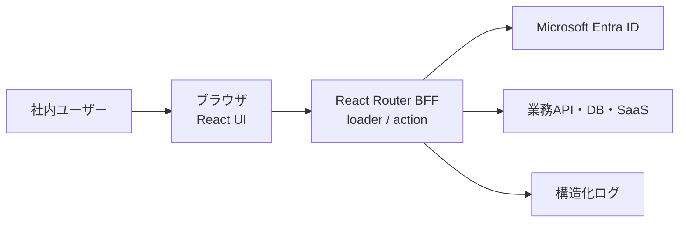

# アーキテクチャ

## 方針

このテンプレートは、ブラウザ、React Router BFF、外部業務APIの3層を基本とします。
初回表示はSSR、以後の画面遷移はクライアント側で行います。

## 境界

### ブラウザ

- 表示と入力を担当する
- APIキー、client secret、アクセストークンを保持しない
- 画面の非表示だけで権限を制御しない

### React Router

- Entra ID認証とセッションを管理する
- loaderで読み取り、actionで更新を行う
- 外部APIの資格情報をサーバー環境変数から取得する
- 入力検証、認可、監査ログを行う

### 外部サービス

- 業務データの正本を保持する
- React Routerから最小権限でアクセスする

## 認証フロー

1. ユーザーが`POST /auth/login`を実行
2. サーバーがランダムなstateとPKCE verifierを生成
3. 一時的なHttpOnly Cookieへ認証フロー情報を保存
4. Entra IDへリダイレクト
5. `/auth/callback`でstateを比較し、認可コードを交換
6. 氏名・メール・識別子だけを署名付きセッションへ保存
7. PKCE verifierを含む一時Cookieを破棄

アクセストークンとclient secretはセッションCookieへ保存しません。Microsoft Graphなどの
委任アクセスが必要なアプリでは、暗号化したサーバー側ストレージを別途設計してください。

## セッション

現在は署名付きCookieセッションです。Cookie内容は改ざん検知されますが、暗号化はされません。
保存してよいのは、社内表示に必要な最小限の識別情報だけです。

次の場合はRedisまたはDBのサーバー側セッションへ変更します。

- アクセストークンや機微情報の保管が必要
- 即時の全端末ログアウトが必要
- セッション失効を中央管理する必要
- 1ユーザーあたりの同時セッション数を制限する必要

## 適用範囲

向いている用途:

- 認証付きCRUD
- 社内管理画面
- 外部API連携
- 生成AI・RAGのフロント/BFF
- 小規模なワークフロー

別バックエンドを検討する用途:

- 長時間バッチ
- ジョブキュー
- 多数のシステムから共用されるAPI
- 大量データ処理
- 複雑なトランザクション
