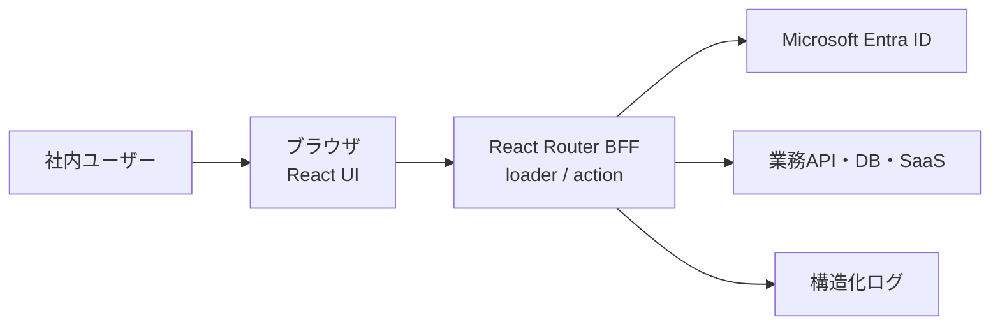

# アーキテクチャ

## 方針

このテンプレートは、ブラウザ、React Router BFF、外部業務APIの3層を基本とします。
初回表示はSSR、以後の画面遷移はクライアント側で行います。

## 境界

### ブラウザ

- 表示と入力を担当する
- APIキー、client secret、アクセストークンを保持しない
- 画面の非表示だけで権限を制御しない

### React Router

- Entra ID認証とセッションを管理する
- loaderで読み取り、actionで更新を行う
- 外部APIの資格情報をサーバー環境変数から取得する
- 入力検証、認可、監査ログを行う

### 外部サービス

- 業務データの正本を保持する
- React Routerから最小権限でアクセスする

## 認証フロー

1. ユーザーが`POST /auth/login`を実行
2. サーバーがランダムなstateとPKCE verifierを生成
3. 一時的なHttpOnly Cookieへ認証フロー情報を保存
4. Entra IDへリダイレクト
5. `/auth/callback`でstateを比較し、認可コードを交換
6. `tid`、`oid`、`roles`を検証し、氏名・メール・識別子・App Roleだけを
   8時間固定の署名付きセッションへ保存
7. PKCE verifierを含む一時Cookieを破棄

アクセストークンとclient secretはセッションCookieへ保存しません。Microsoft Graphなどの
委任アクセスが必要なアプリでは、暗号化したサーバー側ストレージを別途設計してください。

## セッション

現在は8時間固定の署名付きCookieセッションです。操作による有効期限延長は行いません。
Cookie内容は改ざん検知されますが、暗号化されません。保存してよいのは、社内表示に
必要な最小限の識別情報だけです。Entra IDでは`User`と`Admin`のApp Roleを使い、
グループObject IDをアプリ設定に持ちません。`Admin`は一般機能も利用できます。

次の場合はRedisまたはDBのサーバー側セッションへ変更します。

- アクセストークンや機微情報の保管が必要
- 即時の全端末ログアウトが必要
- セッション失効を中央管理する必要
- 1ユーザーあたりの同時セッション数を制限する必要

## 適用範囲

向いている用途:

- 認証付きCRUD
- 社内管理画面
- 外部API連携
- 生成AI・RAGのフロント/BFF
- 小規模なワークフロー

別バックエンドを検討する用途:

- 長時間バッチ
- ジョブキュー
- 多数のシステムから共用されるAPI
- 大量データ処理
- 複雑なトランザクション

## 「資料みて！」固有の実行境界

アップロードされたHTMLは信頼せず、アプリ本体とは別オリジンのHTML表示サービスで
配信します。アプリのセッションCookieは表示サービスへ送らず、対象資料、操作利用者、
有効期限を限定した60秒有効のEd25519署名付き表示grantでアクセスを制御します。
grantはアプリJavaScriptがhidden formのPOST bodyでiframeへ送り、URL、Cookie、ログへ
含めません。JavaScript無効時の表示fallbackは設けません。

- HTMLは改変せず、`html/{documentId}/document.html`のprivate Blobとして保存する
- 表示サービスはNode.js標準HTTPサーバーとし、`GET /health`と`POST /display`だけを持つ
- 表示サービスはBlob取得後に閲覧監査を書き、成功してからHTMLを返す
- CSPとsandboxでJavaScript、外部resource、フォーム、ダウンロード、状態保存を無効化する
- `meta refresh`、`base href`、ページ内以外の相対リンク、`data:`、`file:`、
  独自schemeのリンクを含むHTMLは保存前に拒否する
- `http:`、`https:`、ページ内リンクは確認routeへ置き換えない
- 通常リンクはiframe内、`_blank`は新しいタブで開き、`_top`と`_parent`は無効化する
- リンククリック単位の監査とリンク専用データモデルは設けない

プレビュー生成はChromiumを含む別imageのQueue駆動Container Apps Jobで最大3回試行し、
JavaScriptと外部ネットワークを無効化します。Web、Display、Migration、Maintenanceは
同じNode.js imageを異なるcommandとManaged Identityで使います。Azure実行単位は5つ、
コンテナimageは2種類です。

## データとAzure境界

- PostgreSQLには`pg`で接続し、loader/action、service、repositoryへ分離する
- migrationは`node-pg-migrate`と専用Managed Identityを使い、runtimeへDDL権限を与えない
- HTMLとJPEG previewはprivate Blob、非同期通知はStorage Queueへ保存する
- Web、Display、Preview、Migration、Maintenanceは用途別Managed Identityを使う
- 秘密情報はKey Vault参照で環境変数へ渡し、アプリからKey Vault APIを直接呼ばない
- production、stagingともJapan Eastの単一region、LRS、Container Apps非ゾーン冗長とする
- applicationとdata planeはprivate networkへ限定する
- ACRだけはGitHub-hosted runnerのpush用に認証付きpublic endpointを使う

Infrastructure as CodeはBicep、CI/CDはGitHub ActionsのOIDCを使います。GitHub-hosted
runnerからprivate data planeへ直接接続せず、migrationとsmoke testはVNet内の
Container Apps Jobとして実行します。production DB migrationはforward-onlyかつ
新旧applicationに互換とし、application rollback時にdown migrationは行いません。
詳細は`docs/APPLICATION_DESIGN.md`で定義します。
